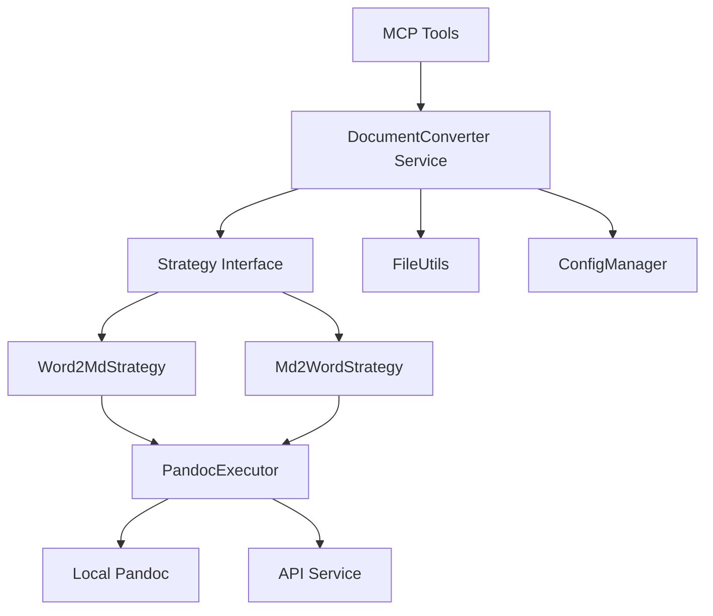

# 设计文档 - 原始需求文档转换器

## 概述

原始需求文档转换器是一个基于 Pandoc 的文档处理系统，为 spec-workflow-mcp 项目提供多格式文档转换能力。该系统支持 Word 到 Markdown（word2md）和 Markdown 到 Word（md2word）双向转换，并能将原始需求文档自动转换为符合 spec-workflow 规范的需求文档。

**核心特性：**

- 双向文档转换（Word ↔ Markdown）
- 策略模式架构，便于扩展其他格式
- 多级降级方案（本地 Pandoc → API 服务）
- 完整的临时文件管理
- 与现有 spec-workflow 流程无缝集成

## 技术标准对齐

### 技术标准 (tech.md)

本设计遵循以下技术标准：

- **TypeScript 开发**：使用 TypeScript 实现类型安全
- **MCP 协议**：遵循 MCP SDK 规范实现工具
- **模块化设计**：采用单一职责原则，每个模块职责清晰
- **错误处理**：统一的错误处理和日志记录机制
- **异步编程**：使用 async/await 处理异步操作

### 项目结构 (structure.md)

实现将遵循项目组织规范：

```
src/
├── tools/                        # MCP 工具定义
│   ├── convert-origin-requirement.ts  # 原始需求转换工具
│   └── md2word.ts                     # Markdown 转 Word 工具
├── services/                     # 业务服务层
│   ├── document-converter.ts          # 文档转换服务
│   ├── strategies/                    # 转换策略实现
│   │   ├── conversion-strategy.ts     # 策略接口
│   │   ├── word2md-strategy.ts        # Word 转 MD 策略
│   │   └── md2word-strategy.ts        # MD 转 Word 策略
│   └── pandoc-executor.ts             # Pandoc 命令执行器
├── utils/                        # 工具函数
│   ├── file-utils.ts                  # 文件操作工具
│   └── path-utils.ts                  # 路径处理工具
└── types/                        # 类型定义
    └── converter-types.ts             # 转换器类型定义
```

## 代码复用分析

### 现有组件复用

- **ConfigManager** (`src/utils/config.ts`)：复用配置管理逻辑，读取 `pandocPath` 和 `converterApiUrl`
- **Logger** (`src/utils/logger.ts`)：复用日志记录机制，统一错误和调试信息输出
- **FileSystem Utils**：复用现有的文件操作工具（如果存在）
- **MCP Tool Registration**：复用现有的 MCP 工具注册机制

### 集成点

- **MCP Server** (`src/index.ts`)：注册新的 MCP tools
- **Config System** (`.spec-workflow/config.toml`)：扩展配置项以支持 Pandoc 和 API 配置
- **Dashboard**：集成转换状态显示（可选，未来扩展）

## 架构设计

### 整体架构

系统采用**策略模式 + 服务层**架构，实现高内聚低耦合：



### 模块化设计原则

1. **单一职责**：每个类/模块负责一个明确的功能

   - `DocumentConverter`：协调转换流程
   - `Strategy`：实现具体转换逻辑
   - `PandocExecutor`：执行 Pandoc 命令

2. **依赖倒置**：高层模块不依赖低层模块，都依赖抽象

   - 通过 `IConversionStrategy` 接口解耦

3. **开闭原则**：对扩展开放，对修改关闭
   - 新增转换类型只需添加新策略，无需修改现有代码

## 组件和接口

### 1. MCP Tool: convert-origin-requirement

**目的：** 将原始需求文档转换为符合 spec-workflow 规范的需求文档

**接口：**

```typescript
interface ConvertOriginRequirementInput {
  filename: string; // 原始文件名（支持 #前缀）
  specName?: string; // 目标 spec 名称（可选，自动生成）
  outputPath?: string; // 自定义输出路径（可选）
}

interface ConvertOriginRequirementResult {
  success: boolean;
  outputPath: string; // 生成的需求文档路径
  tempPath?: string; // 临时文件路径（如有转换）
  message: string;
  summary?: {
    title: string;
    sectionsCount: number;
  };
}
```

**依赖：**

- `DocumentConverter`（文档转换服务）
- `ConfigManager`（配置管理）
- `FileUtils`（文件操作）

**处理流程：**

1. 解析 `filename`（去除 `#` 前缀）
2. 在 `origin-requirements/` 查找文件
3. 根据扩展名判断是否需要转换
4. 调用 `DocumentConverter` 进行转换（如需）
5. 读取 Markdown 内容
6. 转换为 spec-workflow 规范格式
7. 保存到 `.spec-workflow/specs/{spec-name}/requirements.md`

### 2. MCP Tool: md2word

**目的：** 将 Markdown 文件转换为 Word 文档

**接口：**

```typescript
interface Md2WordInput {
  filePath: string; // Markdown 文件完整路径
  outputPath?: string; // 自定义输出路径（可选）
}

interface Md2WordResult {
  success: boolean;
  outputPath: string; // 生成的 Word 文档路径
  message: string;
}
```

**依赖：**

- `DocumentConverter`（文档转换服务）
- `Md2WordStrategy`（转换策略）

**处理流程：**

1. 验证输入文件存在且为 `.md` 格式
2. 确定输出路径（默认为同级目录）
3. 调用 `DocumentConverter.convert('md2word', ...)`
4. 返回生成的 Word 文件路径

### 3. Service: DocumentConverter

**目的：** 文档转换服务的协调者，管理转换策略和配置

**接口：**

```typescript
class DocumentConverter {
  constructor(config: ConverterConfig);

  async convert(
    type: "word2md" | "md2word",
    inputPath: string,
    outputPath: string,
    options?: ConversionOptions
  ): Promise<ConversionResult>;

  private getStrategy(type: string): IConversionStrategy;
  private shouldUsePandoc(): Promise<boolean>;
}

interface ConverterConfig {
  pandocPath?: string; // Pandoc 路径
  converterApiUrl?: string; // API 服务地址
  tempDir: string; // 临时文件目录
}

interface ConversionResult {
  success: boolean;
  outputPath: string;
  tempFiles?: string[]; // 临时文件列表
  error?: Error;
}
```

**依赖：**

- `IConversionStrategy`（策略接口）
- `PandocExecutor`（Pandoc 执行器）
- `ConfigManager`（配置管理）

**核心逻辑：**

```typescript
async convert(type, inputPath, outputPath, options) {
  // 1. 选择策略
  const strategy = this.getStrategy(type);

  // 2. 判断使用本地 Pandoc 还是 API
  const usePandoc = await this.shouldUsePandoc();

  // 3. 执行转换
  if (usePandoc) {
    return await strategy.convertWithPandoc(inputPath, outputPath);
  } else {
    return await strategy.convertWithApi(inputPath, outputPath, this.config.converterApiUrl);
  }
}
```

### 4. Strategy Interface: IConversionStrategy

**目的：** 定义转换策略的统一接口

**接口：**

```typescript
interface IConversionStrategy {
  convertWithPandoc(
    inputPath: string,
    outputPath: string,
    options?: PandocOptions
  ): Promise<ConversionResult>;

  convertWithApi(
    inputPath: string,
    outputPath: string,
    apiUrl: string
  ): Promise<ConversionResult>;
}

interface PandocOptions {
  extractMedia?: string; // 媒体提取目录
  format?: string; // 输入格式（docx/gfm）
  outputFormat?: string; // 输出格式（gfm/docx）
  wrapMode?: "none" | "auto"; // 文本换行模式
}
```

### 5. Strategy Implementation: Word2MdStrategy

**目的：** 实现 Word 到 Markdown 的转换逻辑

**Pandoc 命令构建：**

```typescript
class Word2MdStrategy implements IConversionStrategy {
  async convertWithPandoc(
    inputPath: string,
    outputPath: string
  ): Promise<ConversionResult> {
    const filename = path.basename(inputPath, path.extname(inputPath));
    const outputDir = path.join(path.dirname(inputPath), ".temp", filename);

    // 创建输出目录
    await fs.mkdir(outputDir, { recursive: true });

    // 构建命令
    const cmd = [
      this.pandocPath,
      inputPath,
      "-f",
      "docx",
      "-t",
      "gfm",
      "--extract-media",
      path.join(outputDir, "media"),
      "--wrap=none",
      "-o",
      path.join(outputDir, `${filename}.md`),
    ];

    // 执行转换
    await this.executor.execute(cmd);

    return {
      success: true,
      outputPath: path.join(outputDir, `${filename}.md`),
      tempFiles: [outputDir],
    };
  }

  async convertWithApi(
    inputPath: string,
    outputPath: string,
    apiUrl: string
  ): Promise<ConversionResult> {
    const filename = path.basename(inputPath, path.extname(inputPath));
    const outputDir = path.join(path.dirname(inputPath), ".temp", filename);

    // 发送文件到 API
    const formData = new FormData();
    formData.append("file", await fs.readFile(inputPath));
    formData.append("type", "word2md");

    const response = await fetch(apiUrl, {
      method: "POST",
      body: formData,
    });

    if (!response.ok) {
      throw new Error(`API request failed: ${response.status}`);
    }

    // 接收压缩包并解压
    const zipBuffer = await response.arrayBuffer();
    await this.extractZip(zipBuffer, outputDir);

    return {
      success: true,
      outputPath: path.join(outputDir, `${filename}.md`),
      tempFiles: [outputDir],
    };
  }
}
```

### 6. Strategy Implementation: Md2WordStrategy

**目的：** 实现 Markdown 到 Word 的转换逻辑

**Pandoc 命令构建：**

```typescript
class Md2WordStrategy implements IConversionStrategy {
  async convertWithPandoc(
    inputPath: string,
    outputPath?: string
  ): Promise<ConversionResult> {
    const inputDir = path.dirname(inputPath);
    const filename = path.basename(inputPath, ".md");
    const output = outputPath || path.join(inputDir, `${filename}.docx`);

    // 构建命令
    const cmd = [
      this.pandocPath,
      inputPath,
      "-f",
      "gfm",
      "-t",
      "docx",
      "-o",
      output,
    ];

    // 执行转换
    await this.executor.execute(cmd);

    return {
      success: true,
      outputPath: output,
    };
  }

  async convertWithApi(
    inputPath: string,
    outputPath: string,
    apiUrl: string
  ): Promise<ConversionResult> {
    const inputDir = path.dirname(inputPath);
    const filename = path.basename(inputPath, ".md");
    const output = outputPath || path.join(inputDir, `${filename}.docx`);

    // 发送文件到 API
    const formData = new FormData();
    formData.append("file", await fs.readFile(inputPath));
    formData.append("type", "md2word");

    const response = await fetch(apiUrl, {
      method: "POST",
      body: formData,
    });

    if (!response.ok) {
      throw new Error(`API request failed: ${response.status}`);
    }

    // 接收文件流并保存
    const buffer = await response.arrayBuffer();
    await fs.writeFile(output, Buffer.from(buffer));

    return {
      success: true,
      outputPath: output,
    };
  }
}
```

### 7. Utility: PandocExecutor

**目的：** 执行 Pandoc 命令并处理结果

**接口：**

```typescript
class PandocExecutor {
  constructor(private pandocPath: string);

  async checkAvailability(): Promise<boolean>;
  async execute(args: string[]): Promise<ExecutionResult>;
  private handleError(error: any): never;
}

interface ExecutionResult {
  stdout: string;
  stderr: string;
  exitCode: number;
}
```

**实现：**

```typescript
class PandocExecutor {
  async checkAvailability(): Promise<boolean> {
    try {
      const result = await this.execute(["--version"]);
      return result.exitCode === 0;
    } catch {
      return false;
    }
  }

  async execute(args: string[]): Promise<ExecutionResult> {
    return new Promise((resolve, reject) => {
      const process = spawn(this.pandocPath, args);

      let stdout = "";
      let stderr = "";

      process.stdout.on("data", (data) => {
        stdout += data;
      });
      process.stderr.on("data", (data) => {
        stderr += data;
      });

      process.on("close", (code) => {
        if (code === 0) {
          resolve({ stdout, stderr, exitCode: code });
        } else {
          reject(new Error(`Pandoc failed: ${stderr}`));
        }
      });
    });
  }
}
```

## 数据模型

### ConversionConfig

```typescript
interface ConversionConfig {
  // Pandoc 配置
  pandocPath?: string; // Pandoc 可执行文件路径

  // API 配置
  converterApiUrl?: string; // 转换 API 服务地址
  apiTimeout?: number; // API 超时时间（默认 30000ms）

  // 路径配置
  originRequirementsDir: string; // 原始需求目录
  tempDir: string; // 临时文件目录

  // 其他配置
  verbose?: boolean; // 详细日志模式
}
```

### ConversionTask

```typescript
interface ConversionTask {
  id: string; // 任务 ID
  type: "word2md" | "md2word"; // 转换类型
  inputPath: string; // 输入文件路径
  outputPath: string; // 输出文件路径
  status: "pending" | "running" | "completed" | "failed";
  createdAt: Date;
  completedAt?: Date;
  error?: Error;
}
```

### PandocCommand

```typescript
interface PandocCommand {
  executable: string; // Pandoc 可执行文件路径
  args: string[]; // 命令参数
  workingDir?: string; // 工作目录
}
```

## 配置管理

### 配置优先级

系统按以下优先级读取 Pandoc 路径配置：

1. **命令行参数** `--pandocPath`（最高）
2. **配置文件** `.spec-workflow/config.toml` 中的 `pandocPath`
3. **系统 PATH** 中的 `pandoc` 命令
4. **API 服务** `converterApiUrl`（降级方案）

### 配置文件示例

```toml
# .spec-workflow/config.toml

# Pandoc 可执行文件路径（可选）
pandocPath = "/usr/local/bin/pandoc"

# 文档转换 API 服务地址（降级方案）
converterApiUrl = "https://converter-api.example.com/convert"

# API 请求超时时间（毫秒）
apiTimeout = 30000

# 临时文件目录（相对于项目根目录）
tempDir = "origin-requirements/.temp"
```

### 配置加载逻辑

```typescript
class ConfigLoader {
  static async loadConfig(cliArgs: CliArgs): Promise<ConversionConfig> {
    // 1. 从命令行参数读取
    if (cliArgs.pandocPath) {
      return { pandocPath: cliArgs.pandocPath, ...defaultConfig };
    }

    // 2. 从配置文件读取
    const fileConfig = await this.loadConfigFile();
    if (fileConfig.pandocPath) {
      return { ...defaultConfig, ...fileConfig };
    }

    // 3. 尝试系统 PATH
    const systemPandoc = await this.findInSystemPath("pandoc");
    if (systemPandoc) {
      return { pandocPath: systemPandoc, ...defaultConfig };
    }

    // 4. 使用 API 服务
    return { ...defaultConfig, ...fileConfig };
  }
}
```

## 错误处理

### 错误场景

#### 1. 文件不存在错误

```typescript
class FileNotFoundError extends Error {
  constructor(filePath: string) {
    super(`File not found: ${filePath}`);
    this.name = "FileNotFoundError";
  }
}
```

**处理：** 返回友好提示，指明文件路径

**用户影响：** 看到明确的错误提示和建议

#### 2. Pandoc 不可用错误

```typescript
class PandocUnavailableError extends Error {
  constructor() {
    super(
      "Pandoc is not available. Please install Pandoc or configure converterApiUrl."
    );
    this.name = "PandocUnavailableError";
  }
}
```

**处理：** 自动降级到 API 服务

**用户影响：** 系统自动切换，用户无感知（除非 API 也不可用）

#### 3. 转换失败错误

```typescript
class ConversionError extends Error {
  constructor(
    public type: "word2md" | "md2word",
    public inputPath: string,
    public cause: Error
  ) {
    super(`Conversion failed: ${cause.message}`);
    this.name = "ConversionError";
  }
}
```

**处理：** 记录详细日志，返回错误信息

**用户影响：** 看到具体失败原因和建议

#### 4. API 服务错误

```typescript
class ApiServiceError extends Error {
  constructor(public statusCode: number, public responseBody: string) {
    super(`API service error (${statusCode}): ${responseBody}`);
    this.name = "ApiServiceError";
  }
}
```

**处理：** 重试机制（最多 3 次），失败后返回错误

**用户影响：** 看到网络错误提示和建议

#### 5. 解压缩失败错误

```typescript
class ExtractionError extends Error {
  constructor(zipPath: string, cause: Error) {
    super(`Failed to extract zip file: ${zipPath}. ${cause.message}`);
    this.name = "ExtractionError";
  }
}
```

**处理：** 删除损坏的临时文件，返回错误

**用户影响：** 看到解压失败提示

### 统一错误处理

```typescript
class ErrorHandler {
  static handle(error: Error, context: string): never {
    // 记录错误日志
    logger.error(`[${context}] ${error.name}: ${error.message}`, {
      stack: error.stack,
      context,
    });

    // 根据错误类型返回不同提示
    if (error instanceof FileNotFoundError) {
      throw new Error(`未找到文件 '${error.filePath}'，请检查文件路径`);
    }

    if (error instanceof PandocUnavailableError) {
      throw new Error("本地 Pandoc 不可用，正在降级到 API 服务...");
    }

    if (error instanceof ApiServiceError) {
      throw new Error(
        `API 转换服务不可用（HTTP ${error.statusCode}），` +
          `请检查网络连接或配置 pandocPath 参数`
      );
    }

    // 默认错误处理
    throw error;
  }
}
```

## 测试策略

### 单元测试

**目标：** 覆盖核心转换逻辑和边界条件

**测试用例：**

1. **PandocExecutor 测试**

   ```typescript
   describe("PandocExecutor", () => {
     it("should check pandoc availability", async () => {
       const executor = new PandocExecutor("/usr/local/bin/pandoc");
       const available = await executor.checkAvailability();
       expect(available).toBe(true);
     });

     it("should execute pandoc command", async () => {
       const executor = new PandocExecutor("pandoc");
       const result = await executor.execute(["--version"]);
       expect(result.exitCode).toBe(0);
     });
   });
   ```

2. **Word2MdStrategy 测试**

   ```typescript
   describe("Word2MdStrategy", () => {
     it("should convert Word to Markdown with Pandoc", async () => {
       const strategy = new Word2MdStrategy(mockExecutor);
       const result = await strategy.convertWithPandoc(
         "test.docx",
         ".temp/test/"
       );
       expect(result.success).toBe(true);
       expect(fs.existsSync(result.outputPath)).toBe(true);
     });

     it("should handle Pandoc failure gracefully", async () => {
       const strategy = new Word2MdStrategy(failingExecutor);
       await expect(
         strategy.convertWithPandoc("test.docx", ".temp/test/")
       ).rejects.toThrow(ConversionError);
     });
   });
   ```

3. **Md2WordStrategy 测试**

   ```typescript
   describe("Md2WordStrategy", () => {
     it("should convert Markdown to Word", async () => {
       const strategy = new Md2WordStrategy(mockExecutor);
       const result = await strategy.convertWithPandoc("test.md", "test.docx");
       expect(result.success).toBe(true);
       expect(fs.existsSync("test.docx")).toBe(true);
     });
   });
   ```

4. **ConfigLoader 测试**
   ```typescript
   describe("ConfigLoader", () => {
     it("should prioritize CLI args over config file", async () => {
       const config = await ConfigLoader.loadConfig({
         pandocPath: "/custom/pandoc",
       });
       expect(config.pandocPath).toBe("/custom/pandoc");
     });

     it("should fall back to API when Pandoc unavailable", async () => {
       const config = await ConfigLoader.loadConfig({});
       expect(config.converterApiUrl).toBeDefined();
     });
   });
   ```

### 集成测试

**目标：** 测试完整的转换流程

**测试场景：**

1. **Word 转 Markdown 完整流程**

   ```typescript
   it("should convert Word document to spec-workflow requirements", async () => {
     // 准备测试文件
     const testDocx = "test-fixtures/sample.docx";

     // 执行转换
     const result = await convertOriginRequirement({
       filename: "#sample.docx",
       specName: "test-spec",
     });

     // 验证结果
     expect(result.success).toBe(true);
     expect(fs.existsSync(result.outputPath)).toBe(true);

     // 验证临时文件
     const tempDir = "origin-requirements/.temp/sample";
     expect(fs.existsSync(tempDir)).toBe(true);
     expect(fs.existsSync(`${tempDir}/sample.md`)).toBe(true);
   });
   ```

2. **Markdown 转 Word 流程**

   ```typescript
   it("should convert Markdown to Word document", async () => {
     const testMd = "test-fixtures/sample.md";

     const result = await md2word({
       filePath: testMd,
     });

     expect(result.success).toBe(true);
     expect(fs.existsSync(result.outputPath)).toBe(true);
     expect(result.outputPath).toMatch(/\.docx$/);
   });
   ```

3. **Pandoc 降级到 API 流程**
   ```typescript
   it("should fall back to API when Pandoc unavailable", async () => {
     // 模拟 Pandoc 不可用
     mockPandocExecutor.checkAvailability.mockResolvedValue(false);

     // 执行转换
     const result = await convertOriginRequirement({
       filename: "#sample.docx",
     });

     // 验证使用了 API
     expect(mockApiClient.convert).toHaveBeenCalled();
     expect(result.success).toBe(true);
   });
   ```

### 端到端测试

**目标：** 模拟真实用户场景

**测试场景：**

1. **完整的需求文档生成流程**

   ```typescript
   it("E2E: Create spec from Word document", async () => {
     // 1. 准备 Word 文档
     const docxPath = "origin-requirements/feature-request.docx";
     await fs.copyFile("test-fixtures/sample.docx", docxPath);

     // 2. 通过 MCP 工具转换
     const result = await mcpServer.callTool("convert-origin-requirement", {
       filename: "#feature-request.docx",
       specName: "my-feature",
     });

     // 3. 验证生成的需求文档
     const requirementsPath = ".spec-workflow/specs/my-feature/requirements.md";
     expect(fs.existsSync(requirementsPath)).toBe(true);

     // 4. 验证内容格式
     const content = await fs.readFile(requirementsPath, "utf-8");
     expect(content).toMatch(/# 需求文档/);
     expect(content).toMatch(/## 介绍/);
   });
   ```

2. **双向转换场景**
   ```typescript
   it("E2E: Word -> Markdown -> Word conversion", async () => {
     // 1. Word 转 Markdown
     const word2mdResult = await convertOriginRequirement({
       filename: "#original.docx",
     });

     // 2. Markdown 转 Word
     const md2wordResult = await md2word({
       filePath: word2mdResult.tempPath,
     });

     // 3. 验证两个 Word 文档内容相似
     expect(fs.existsSync(md2wordResult.outputPath)).toBe(true);
   });
   ```

### 测试覆盖目标

- **单元测试覆盖率**：>= 80%
- **集成测试覆盖**：核心转换流程 100%
- **E2E 测试覆盖**：主要用户场景 100%

## 性能考虑

### 性能目标

- 单个文档转换时间：< 5 秒（本地 Pandoc）
- API 转换超时：30 秒
- 并发转换支持：最多 5 个任务同时进行

### 优化策略

1. **缓存机制**：相同文件的转换结果缓存在 `.temp/` 目录
2. **并发控制**：使用队列管理多个转换任务
3. **流式处理**：大文件使用流式读写，避免内存溢出
4. **增量转换**：检测文件变更，只转换修改过的文件

## 安全性考虑

### 安全措施

1. **路径遍历防护**：验证所有文件路径，禁止 `../` 等危险路径
2. **文件大小限制**：上传到 API 的文件限制为 10MB
3. **HTTPS 强制**：API 调用必须使用 HTTPS
4. **敏感信息保护**：日志中不记录文件完整内容
5. **命令注入防护**：Pandoc 命令参数严格校验

### 实现示例

```typescript
class SecurityValidator {
  static validatePath(filePath: string, baseDir: string): void {
    const resolved = path.resolve(baseDir, filePath);
    if (!resolved.startsWith(baseDir)) {
      throw new Error("Path traversal detected");
    }
  }

  static validateFileSize(
    filePath: string,
    maxSize: number = 10 * 1024 * 1024
  ): void {
    const stats = fs.statSync(filePath);
    if (stats.size > maxSize) {
      throw new Error(`File size exceeds limit: ${maxSize} bytes`);
    }
  }

  static sanitizeCommand(args: string[]): string[] {
    // 移除危险字符
    return args.map((arg) => arg.replace(/[;&|`$()]/g, ""));
  }
}
```

## 部署考虑

### Docker 支持

Dockerfile 中需要安装 Pandoc：

```dockerfile
FROM node:20-alpine

# 安装 Pandoc
RUN apk add --no-cache pandoc

# 验证安装
RUN pandoc --version

# ... 其他构建步骤
```

### 环境要求

- Node.js >= 20.x
- Pandoc >= 2.19（可选，有 API 降级）
- 磁盘空间：至少 100MB 用于临时文件

## 未来扩展

### 预留接口

1. **Excel2MdStrategy**：支持 Excel 转 Markdown
2. **Pdf2MdStrategy**：支持 PDF 转 Markdown
3. **Html2MdStrategy**：支持 HTML 转 Markdown

### 架构扩展点

- 策略注册机制：动态加载转换策略
- 插件系统：支持第三方转换器
- 转换流水线：支持多步骤转换（如 PDF → Word → Markdown）
