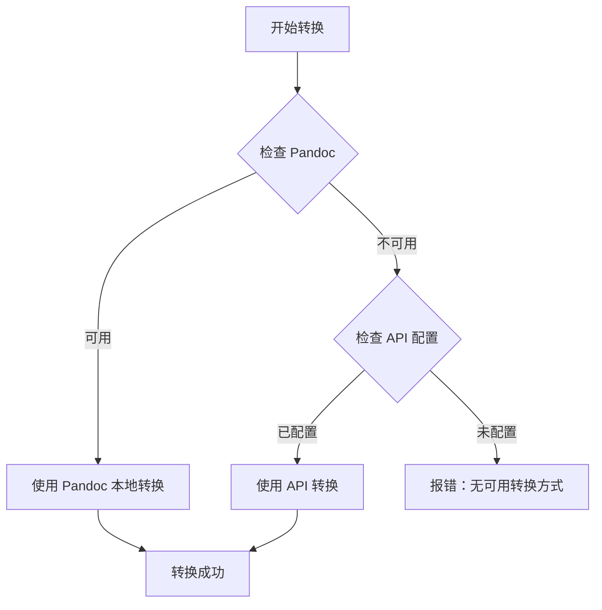

# 文档转换器功能

## 概述

Spec Workflow MCP 内置了强大的文档转换功能，支持 Word 和 Markdown 文档的双向转换。这使得你可以：

- 📄 将现有的 Word 需求文档转换为 Markdown 格式
- 📝 将 Markdown 文档导出为 Word 格式
- 🔄 在 spec-workflow 中无缝处理各种格式的文档

## 功能特性

### 支持的转换类型

| 转换方向        | 输入格式        | 输出格式 | MCP 工具                     |
| --------------- | --------------- | -------- | ---------------------------- |
| Word → Markdown | `.docx`, `.doc` | `.md`    | `convert-origin-requirement` |
| Markdown → Word | `.md`           | `.docx`  | `md2word`                    |

### 转换方式

系统支持两种转换方式，并能自动降级：

1. **本地 Pandoc** (优先)

   - 高性能，无网络依赖
   - 完整的格式支持
   - 需要安装 Pandoc

2. **API 服务** (降级)
   - 无需本地安装
   - 自动降级机制
   - 需要配置 API URL

## 安装和配置

### 安装 Pandoc (推荐)

#### macOS

```bash
brew install pandoc
```

#### Linux (Ubuntu/Debian)

```bash
sudo apt-get update
sudo apt-get install pandoc
```

#### Windows

```powershell
choco install pandoc
```

或从 [Pandoc 官网](https://pandoc.org/installing.html) 下载安装包。

### 配置选项

在 `.spec-workflow/config.toml` 中配置转换器：

```toml
# Pandoc 可执行文件路径（可选）
# 如果不指定，将在系统 PATH 中查找
pandocPath = "/usr/local/bin/pandoc"

# 转换 API 服务地址（可选）
# 当 Pandoc 不可用时作为降级方案
converterApiUrl = "https://your-converter-api.com"

# API 请求超时时间（毫秒）
apiTimeout = 30000
```

#### 配置优先级

配置的优先级从高到低：

1. 命令行参数
2. 配置文件 `.spec-workflow/config.toml`
3. 系统 PATH 中的 Pandoc
4. API 服务

## MCP 工具使用

### convert-origin-requirement

将原始需求文档转换为 spec-workflow 规范格式。

**使用场景**：

- 将现有的 Word 需求文档导入到 spec-workflow
- 快速开始新的规格开发

**参数**：

```typescript
{
  projectPath: string;      // 项目根目录路径
  filename: string;          // 文件名（支持 # 前缀）
  specName?: string;         // 目标 spec 名称（可选）
  config?: {
    pandocPath?: string;
    converterApiUrl?: string;
  };
}
```

**示例**：

```javascript
// 基本使用
{
  "projectPath": "/path/to/project",
  "filename": "#requirement.docx"
}

// 指定 spec 名称
{
  "projectPath": "/path/to/project",
  "filename": "requirement.docx",
  "specName": "user-authentication"
}

// 使用自定义 Pandoc 路径
{
  "projectPath": "/path/to/project",
  "filename": "requirement.md",
  "config": {
    "pandocPath": "/custom/path/to/pandoc"
  }
}
```

**工作流程**：

1. 在项目根目录创建 `origin-requirements/` 目录
2. 将原始需求文档放入该目录
3. 调用 `convert-origin-requirement` 工具
4. 系统会：
   - 检测文件格式
   - 如果是 Word，自动转换为 Markdown
   - 将内容转换为 spec-workflow 规范格式
   - 保存到 `.spec-workflow/specs/{spec-name}/requirements.md`

### md2word

将 Markdown 文件转换为 Word 文档。

**使用场景**：

- 导出规格文档为 Word 格式
- 与不熟悉 Markdown 的团队成员共享文档
- 生成可打印的文档

**参数**：

```typescript
{
  projectPath: string;       // 项目根目录路径
  filePath: string;          // Markdown 文件路径
  outputPath?: string;       // 输出路径（可选）
  config?: {
    pandocPath?: string;
    converterApiUrl?: string;
  };
}
```

**示例**：

```javascript
// 基本使用（输出到同目录）
{
  "projectPath": "/path/to/project",
  "filePath": ".spec-workflow/specs/my-spec/requirements.md"
}

// 指定输出路径
{
  "projectPath": "/path/to/project",
  "filePath": "docs/api-design.md",
  "outputPath": "exports/api-design.docx"
}

// 使用 API 服务
{
  "projectPath": "/path/to/project",
  "filePath": "README.md",
  "config": {
    "converterApiUrl": "https://converter-api.example.com"
  }
}
```

## 文件组织

### 目录结构

```
your-project/
├── origin-requirements/          # 原始需求文档目录
│   ├── user-auth.docx
│   ├── payment-flow.md
│   └── feature-spec.doc
├── .spec-workflow/
│   ├── specs/
│   │   └── user-auth/
│   │       └── requirements.md   # 转换后的规范需求文档
│   └── config.toml               # 转换器配置
└── .temp/                        # 临时文件（自动管理）
    └── origin-conversions/
```

### 输出格式

#### Word → Markdown

转换 Word 文档时，系统会：

- 提取文档内容为 Markdown 格式
- 提取所有图片到 `media/` 目录
- 保持原始格式结构（标题、列表、表格等）
- 转换为 GitHub Flavored Markdown (GFM)

输出结构：

```
.temp/document-name/
├── document-name.md          # Markdown 文件
└── media/                    # 提取的图片
    ├── image1.png
    └── image2.jpg
```

#### Markdown → Word

转换 Markdown 时，系统会：

- 保留所有 Markdown 格式
- 转换代码块为格式化代码
- 处理表格和列表
- 嵌入图片（如果路径有效）

## 高级功能

### 自动降级

系统会自动选择最佳转换方式：



### 强制指定转换方式

通过配置选项强制使用特定方式：

```javascript
// 强制使用 Pandoc
{
  ...
  options: {
    forcePandoc: true
  }
}

// 强制使用 API
{
  ...
  options: {
    forceApi: true
  }
}
```

### 自定义 Pandoc 参数

```javascript
{
  ...
  options: {
    pandocArgs: [
      "--toc",                    // 生成目录
      "--toc-depth=3",            // 目录深度
      "--standalone"              // 独立文档
    ]
  }
}
```

## 格式支持

### Markdown 特性

转换支持以下 Markdown 特性：

- ✅ 标题 (H1-H6)
- ✅ 列表（有序、无序）
- ✅ 表格
- ✅ 代码块（带语法高亮）
- ✅ 链接和图片
- ✅ 粗体、斜体、删除线
- ✅ 引用块
- ✅ 分隔线
- ✅ 任务列表

### Word 特性

从 Word 转换时保留：

- ✅ 文档结构（标题层级）
- ✅ 表格和列表
- ✅ 图片（自动提取）
- ✅ 超链接
- ✅ 文本格式（粗体、斜体）
- ⚠️ 复杂排版可能简化
- ⚠️ 自定义样式可能丢失

## 故障排查

### Pandoc 未找到

**错误信息**：

```
Pandoc 不可用
```

**解决方案**：

1. 安装 Pandoc（见安装部分）
2. 检查 PATH 环境变量
3. 在配置中指定 Pandoc 完整路径
4. 或配置 API 服务作为降级

### 文件大小限制

**限制**：10MB

**错误信息**：

```
文件大小超出限制: XXmB (限制: 10MB)
```

**解决方案**：

- 压缩文件（优化图片）
- 拆分大文档
- 联系管理员调整限制

### 转换失败

**常见原因**：

1. **文件格式不支持**

   - 确认文件扩展名正确
   - 支持：`.docx`, `.doc`, `.md`

2. **文件损坏**

   - 尝试用 Word 重新保存
   - 检查文件完整性

3. **权限问题**
   - 检查文件读写权限
   - 确保目录可访问

### 图片路径问题

**问题**：Markdown → Word 时图片不显示

**解决方案**：

- 使用相对路径引用图片
- 确保图片文件存在
- 图片路径不包含特殊字符

## 性能优化

### 批量转换

对于多个文件，可以依次调用工具：

```javascript
// 伪代码示例
const files = ["doc1.docx", "doc2.docx", "doc3.md"];

for (const file of files) {
  await convertOriginRequirement({
    projectPath: "/path/to/project",
    filename: file,
  });
}
```

### 临时文件管理

系统会自动管理临时文件：

- 转换完成后保留在 `.temp/` 目录
- 可定期手动清理
- 建议将 `.temp/` 添加到 `.gitignore`

```bash
# 清理临时文件
rm -rf .temp/origin-conversions/
```

## 最佳实践

### 1. 文档准备

**Word 文档**：

- 使用标准样式（标题 1-6）
- 避免复杂的页面布局
- 图片使用常见格式（PNG, JPG）
- 表格结构清晰

**Markdown 文档**：

- 遵循 GitHub Flavored Markdown
- 图片使用相对路径
- 代码块指定语言

### 2. 工作流程

推荐的文档转换工作流：

1. **导入阶段**

   ```
   原始 Word → origin-requirements/
   → convert-origin-requirement
   → .spec-workflow/specs/{name}/requirements.md
   ```

2. **开发阶段**

   ```
   在 Markdown 中编辑和维护文档
   使用 spec-workflow 流程
   ```

3. **交付阶段**
   ```
   Markdown → md2word → Word 文档
   分享给团队或客户
   ```

### 3. 版本控制

```gitignore
# .gitignore

# 临时转换文件
.temp/origin-conversions/

# 原始文档（可选）
origin-requirements/*.docx
origin-requirements/*.doc

# 保留 Markdown 原始文档
!origin-requirements/*.md
```

### 4. 团队协作

- **统一格式**：团队统一使用 Markdown
- **模板文档**：准备 Word 模板供导入
- **文档规范**：制定 Markdown 编写规范
- **定期导出**：定期导出 Word 版本存档

## API 集成

如果你要部署自己的转换 API 服务，请参考以下接口规范：

### API 端点

```
POST /convert
```

### 请求格式

```typescript
{
  type: "word2md" | "md2word",
  fileContent: string,        // Base64 编码
  fileName: string,
  options?: {
    extractMedia?: boolean,
    pandocArgs?: string[]
  }
}
```

### 响应格式

```typescript
{
  success: boolean,
  data: string,              // Base64 编码的结果
  contentType: "application/zip" | "text/markdown" | "application/vnd.openxmlformats",
  message?: string,
  error?: string
}
```

### 健康检查

```
GET /health
```

返回 200 状态码表示服务可用。

## 相关资源

- [Pandoc 官方文档](https://pandoc.org/MANUAL.html)
- [GitHub Flavored Markdown 规范](https://github.github.com/gfm/)
- [Spec Workflow 用户指南](USER-GUIDE.md)
- [配置指南](CONFIGURATION.md)

## 支持

遇到问题？

1. 查看 [故障排查文档](TROUBLESHOOTING.md)
2. 检查 [已知问题](https://github.com/Pimzino/spec-workflow-mcp/issues)
3. 提交新问题并附上：
   - 错误信息
   - Pandoc 版本（`pandoc --version`）
   - 系统信息
   - 最小可复现示例
