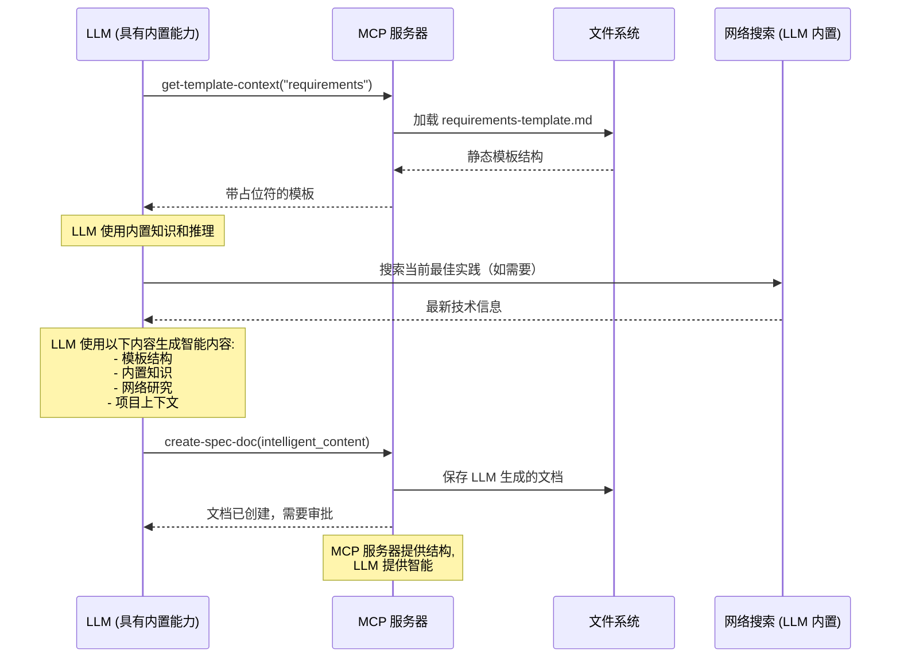

# MCP 工具 API 参考

> **快速导航**: [工作流工具](#工作流工具) | [内容工具](#内容工具) | [搜索工具](#搜索工具) | [状态工具](#状态工具) | [审批工具](#审批工具)

## 📋 工具分类

| 分类 | 工具 | 用途 |
|----------|-------|---------|
| **工作流** | `spec-workflow-guide`, `steering-guide` | 提供工作流指导 |
| **内容** | `create-spec-doc`, `create-steering-doc`, `get-template-context` | 创建和模板化文档 |
| **搜索** | `get-spec-context`, `get-steering-context`, `spec-list` | 查找和加载现有内容 |
| **状态** | `spec-status`, `manage-tasks` | 跟踪进度 |
| **审批** | `request-approval`, `get-approval-status`, `delete-approval` | 管理审批工作流 |

## 🔄 工作流工具

### `spec-workflow-guide`

**用途**: 加载规范驱动开发的完整工作流指导

**使用**: 当用户请求规范创建或功能开发时首先调用

```typescript
// 参数: 无
{}

// 响应
{
  success: true,
  message: "完整规范工作流指南已加载 - 严格遵循此工作流",
  data: {
    guide: "# 规范开发工作流...",
    dashboardUrl?: string,
    dashboardAvailable: boolean
  },
  nextSteps: [
    "遵循顺序: 需求 → 设计 → 任务 → 实现",
    "首先使用 get-template-context 加载模板",
    "在每个文档后请求审批"
  ]
}
```

**工作流顺序**:
1. 需求阶段 → 2. 设计阶段 → 3. 任务阶段 → 4. 实现阶段

**关键规则**:
- ✅ 始终使用 MCP 工具，永不手动创建文档
- ✅ 在每个阶段之间获取明确审批
- ✅ 按顺序完成阶段（不能跳过）
- ❌ 永不接受口头审批 - 仅限仪表板/VS Code

**规划流程架构**:
- ✅ **基于模板的结构**: 使用 `/src/markdown/templates/` 中的静态模板
- ✅ **LLM 驱动的内容生成**: 连接的 LLM 使用其内置能力填充模板
- ✅ **LLM 内置知识**: LLM 应用其训练中的软件工程最佳实践
- ✅ **LLM 网络研究**: LLM 可以执行网络搜索以获取当前技术和实践
- ✅ **工作流验证**: 服务器强制执行正确的顺序和结构
- ✅ **需要人工审核**: 所有 LLM 生成的内容都需要仪表板/VS Code 审批

**内容生成流程**:


---

### `steering-guide`

**用途**: 加载创建项目指导文档的说明

**使用**: 在建立项目指南或架构上下文时调用

```typescript
// 参数: 无
{}

// 响应
{
  success: true,
  message: "指导文档加载成功",
  data: {
    guide: "# 指导文档指南...",
    dashboardUrl?: string
  }
}
```

**指导文档类型**:
- **product.md**: 产品愿景和需求
- **tech.md**: 技术标准和架构决策  
- **structure.md**: 代码组织和文件结构

## 📝 内容工具

### `create-spec-doc`

**用途**: 按照工作流顺序创建或更新规范文档

**使用**: 在为每个阶段加载模板并生成内容后调用

```typescript
// 参数
{
  projectPath: "/absolute/path/to/project",
  specName: "user-authentication",     // 仅限 kebab-case
  document: "requirements",            // "requirements" | "design" | "tasks" 
  content: "# 需求文档\n..." // 完整的 markdown 内容
}

// 响应
{
  success: true,
  message: "已创建 requirements.md 于: .spec-workflow/specs/user-authentication/requirements.md\n\n阻塞: 必须通过仪表板或 VS Code 扩展请求审批。",
  data: {
    specName: "user-authentication",
    document: "requirements",
    filePath: ".spec-workflow/specs/user-authentication/requirements.md"
  }
}
```

**工作流强制执行**:
- ❌ 没有 `requirements.md` 无法创建 `design.md`
- ❌ 没有 `design.md` 无法创建 `tasks.md`
- ✅ 自动创建 `.spec-workflow/specs/` 目录结构

**下一步**: 创建后始终立即调用 `request-approval`

---

### `create-steering-doc`

**用途**: 创建用于架构指导的项目指导文档

```typescript
// 参数
{
  projectPath: "/absolute/path/to/project",
  document: "product",                 // "product" | "tech" | "structure"
  content: "# 产品愿景\n..."     // 完整的 markdown 内容
}

// 响应  
{
  success: true,
  message: "已创建 product.md 于: .spec-workflow/steering/product.md",
  data: {
    document: "product",
    filePath: ".spec-workflow/steering/product.md"
  }
}
```

---

### `get-template-context`

**用途**: 加载具有正确格式的特定文档模板

**使用**: 调用当前阶段所需的确切模板

```typescript
// 参数
{
  projectPath: "/absolute/path/to/project",
  templateType: "spec",                // "spec" | "steering"
  template: "requirements"             // 见下面的模板选项
}

// 响应
{
  success: true,
  message: "已加载规范需求模板",
  data: {
    context: "## 需求模板\n\n[模板内容...]",
    templateType: "spec",
    template: "requirements",
    loaded: "requirements-template.md"
  },
  nextSteps: [
    "使用模板创建需求文档",
    "严格遵循模板结构",
    "下一步: create-spec-doc，document: \"requirements\""
  ]
}
```

**模板选项**:

| templateType | 可用模板 |
|--------------|-------------------|
| `spec` | `requirements`, `design`, `tasks` |
| `steering` | `product`, `tech`, `structure` |

## 🔍 搜索工具

### `get-spec-context`

**用途**: 加载现有规范文档以恢复工作

**使用**: 仅在中断后返回工作于现有规范时调用

```typescript
// 参数
{
  projectPath: "/absolute/path/to/project",
  specName: "user-authentication"
}

// 响应 - 成功
{
  success: true,
  message: "规范上下文加载成功: user-authentication",
  data: {
    context: "## 规范上下文（已预加载）: user-authentication\n\n### 需求\n[内容]\n\n### 设计\n[内容]\n\n### 任务\n[内容]",
    specName: "user-authentication",
    documents: {
      requirements: true,
      design: true, 
      tasks: false
    },
    sections: 2,
    specPath: "/project/.spec-workflow/specs/user-authentication"
  }
}

// 响应 - 未找到
{
  success: false,
  message: "未找到规范: user-authentication",
  data: {
    availableSpecs: ["login-system", "payment-flow"],
    suggestedSpecs: ["login-system", "payment-flow"]
  },
  nextSteps: [
    "可用规范: login-system, payment-flow",
    "使用现有规范名称",
    "或使用 create-spec-doc 创建新规范"
  ]
}
```

**重要**: 文档已在响应中预加载。不要再次调用 `get-content`。

---

### `get-steering-context`

**用途**: 加载项目指导文档以获取架构上下文

**使用**: 在初始规范设置期间调用以检查现有项目指南

```typescript
// 参数
{
  projectPath: "/absolute/path/to/project"
}

// 响应 - 找到文档
{
  success: true,
  message: "指导上下文加载成功",
  data: {
    context: "## 指导文档上下文（已预加载）\n\n### 产品上下文\n[内容]\n\n### 技术上下文\n[内容]",
    documents: {
      product: true,
      tech: true,
      structure: false
    },
    sections: 2
  },
  nextSteps: [
    "指导上下文已加载 - 不要再次调用 get-steering-context",
    "在需求、设计和任务中引用这些标准"
  ]
}

// 响应 - 无文档  
{
  success: true,
  message: "未找到指导文档",
  data: {
    context: "## 指导文档上下文\n\n未找到指导文档。使用检测到的技术栈的最佳实践继续。",
    documents: { product: false, tech: false, structure: false }
  },
  nextSteps: [
    "使用检测到的技术栈的最佳实践和约定",
    "对于已建立的代码库: 询问用户是否要创建指导文档"
  ]
}
```

---

### `spec-list`

**用途**: 列出项目中所有规范及状态信息

**使用**: 在选择要处理的规范之前调用以查看可用规范

```typescript
// 参数
{
  projectPath: "/absolute/path/to/project"
}

// 响应
{
  success: true,
  message: "找到 3 个规范",
  data: {
    specs: [
      {
        name: "user-authentication",
        description: "用户登录和注册系统",
        status: "ready-for-implementation",  // 下面的状态选项
        phases: {
          requirements: true,
          design: true,
          tasks: true,
          implementation: false
        },
        taskProgress: {
          total: 8,
          completed: 0,
          inProgress: 0,
          pending: 8
        },
        lastModified: "2024-01-15T10:30:00Z",
        createdAt: "2024-01-10T09:00:00Z"
      }
    ],
    total: 3,
    summary: {
      byStatus: {
        "ready-for-implementation": 2,
        "in-progress": 1
      },
      totalTasks: 24,
      completedTasks: 8
    }
  }
}
```

**状态值**:
- `not-started`: 未创建文档
- `in-progress`: 某些阶段未完成
- `ready-for-implementation`: 所有阶段已批准
- `implementing`: 实现进行中
- `completed`: 所有任务已完成

## 📊 状态工具

### `spec-status`

**用途**: 获取特定规范的详细状态

```typescript
// 参数
{
  projectPath: "/absolute/path/to/project",
  specName: "user-authentication"
}

// 响应
{
  success: true,
  message: "规范状态检索成功",
  data: {
    name: "user-authentication",
    status: "ready-for-implementation",
    phases: {
      requirements: { exists: true, approved: true },
      design: { exists: true, approved: true },
      tasks: { exists: true, approved: true },
      implementation: { exists: false, approved: false }
    },
    taskProgress: {
      total: 8,
      completed: 0,
      inProgress: 0,
      pending: 8
    },
    nextActions: [
      "从第一个任务开始实现",
      "使用 manage-tasks 跟踪进度"
    ]
  }
}
```

---

### `manage-tasks`

**用途**: 跟踪和更新任务实现进度

**使用**: 仅在实现阶段调用

```typescript
// 列出所有任务
{
  projectPath: "/absolute/path/to/project",
  specName: "user-authentication",
  action: "list"
}

// 获取特定任务
{
  projectPath: "/absolute/path/to/project", 
  specName: "user-authentication",
  action: "get",
  taskId: "1.1"
}

// 更新任务状态 - 关键顺序
{
  projectPath: "/absolute/path/to/project",
  specName: "user-authentication", 
  action: "set-status",
  taskId: "1.1",
  status: "in-progress"        // "pending" | "in-progress" | "completed"
}

// 获取下一个待处理任务
{
  projectPath: "/absolute/path/to/project",
  specName: "user-authentication",
  action: "next-pending"
}
```

**实现顺序**:
1. `set-status` → `"in-progress"` 在编写代码前
2. 编写和测试代码  
3. `set-status` → `"completed"` 在实现后

**响应示例**:
```typescript
// 列表响应
{
  success: true,
  message: "找到 8 个任务（0 个已完成，1 个进行中，7 个待处理）",
  data: {
    tasks: [
      {
        id: "1.1",
        title: "创建用户模型",
        description: "实现带验证的用户数据模型",
        status: "in-progress",
        files: ["src/models/User.ts"],
        requirements: ["REQ-1", "REQ-2"]
      }
    ],
    summary: { total: 8, completed: 0, inProgress: 1, pending: 7 }
  }
}

// 下一个待处理任务响应
{
  success: true,
  message: "找到下一个待处理任务",
  data: {
    task: {
      id: "1.2", 
      title: "创建认证服务",
      status: "pending"
    }
  },
  nextSteps: [
    "在开始前将状态设置为 in-progress",
    "实现任务",  
    "完成后将状态设置为 completed"
  ]
}
```

---

## ✅ 审批工具

### `request-approval`

**用途**: 通过仪表板界面请求用户审批

**使用**: 在创建每个文档后立即调用

```typescript
// 参数
{
  projectPath: "/absolute/path/to/project",
  title: "需求文档审核",
  filePath: ".spec-workflow/specs/user-auth/requirements.md",  // 相对于项目根目录
  type: "document",                    // "document" | "action"
  category: "spec",                    // "spec" | "steering" 
  categoryName: "user-auth"           // 规范名称或 "steering"
}

// 响应
{
  success: true,
  message: "审批请求创建成功。请在仪表板中审核: http://localhost:3456",
  data: {
    approvalId: "user-auth-requirements-20241215-143022",
    title: "需求文档审核",
    filePath: ".spec-workflow/specs/user-auth/requirements.md",
    status: "pending",
    dashboardUrl: "http://localhost:3456"
  },
  nextSteps: [
    "阻塞 - 需要仪表板或 VS Code 扩展审批",
    "不接受口头审批", 
    "使用以下方式轮询状态: get-approval-status \"user-auth-requirements-20241215-143022\""
  ]
}
```

**关键规则**:
- ❌ **永不包含文档内容** - 仅提供 `filePath`
- ❌ **不接受口头审批** - 仅限仪表板/VS Code
- ✅ **等待明确审批** 后再继续

---

### `get-approval-status`

**用途**: 检查待处理审批请求的状态

**使用**: 轮询直到批准或需要修订

```typescript
// 参数  
{
  projectPath: "/absolute/path/to/project",
  approvalId: "user-auth-requirements-20241215-143022"
}

// 响应 - 待处理
{
  success: true,
  message: "审批状态已检索",
  data: {
    status: "pending",
    approvalId: "user-auth-requirements-20241215-143022",
    createdAt: "2024-12-15T14:30:22Z"
  },
  nextSteps: ["继续轮询直到状态改变"]
}

// 响应 - 已批准
{
  success: true,  
  message: "审批状态已检索",
  data: {
    status: "approved",
    approvalId: "user-auth-requirements-20241215-143022",
    approvedAt: "2024-12-15T14:35:10Z"
  },
  nextSteps: ["删除审批并继续下一阶段"]
}

// 响应 - 需要修订
{
  success: true,
  message: "审批状态已检索", 
  data: {
    status: "needs-revision",
    approvalId: "user-auth-requirements-20241215-143022",
    comments: "请在安全需求部分添加更多细节。",
    rejectedAt: "2024-12-15T14:33:45Z"
  },
  nextSteps: [
    "根据评论更新文档",
    "创建新的审批请求",
    "不要继续下一阶段"
  ]
}
```

**状态值**:
- `pending`: 等待用户审核
- `approved`: 准备继续
- `needs-revision`: 需要更改  
- `rejected`: 未批准（罕见）

---

### `delete-approval`

**用途**: 在成功批准后清理审批

**使用**: 在获得 `approved` 状态后、继续前立即调用

```typescript
// 参数
{
  projectPath: "/absolute/path/to/project",
  approvalId: "user-auth-requirements-20241215-143022"
}

// 响应 - 成功
{
  success: true,
  message: "审批删除成功",
  data: {
    approvalId: "user-auth-requirements-20241215-143022",
    deleted: true
  },
  nextSteps: ["继续下一阶段"]
}

// 响应 - 失败  
{
  success: false,
  message: "删除审批失败: 未找到审批或仍在待处理",
  nextSteps: [
    "先检查审批状态",
    "确保在删除前审批已批准", 
    "阻塞: 清理成功前无法继续"
  ]
}
```

**关键**: 如果删除失败，**停止**并返回轮询状态。永不在没有成功清理的情况下继续。

## 🔄 常见使用模式

### 开始新规范
```typescript
1. spec-workflow-guide()
2. get-steering-context(projectPath)  // 可选
3. get-template-context(projectPath, "spec", "requirements")
4. create-spec-doc(projectPath, specName, "requirements", content)
5. request-approval(projectPath, title, filePath, "document", "spec", specName)
6. get-approval-status(projectPath, approvalId) // 轮询直到批准
7. delete-approval(projectPath, approvalId)
8. // 重复设计，然后任务
```

### 实现任务
```typescript
1. get-spec-context(projectPath, specName)  
2. manage-tasks(projectPath, specName, "next-pending")
3. manage-tasks(projectPath, specName, "set-status", taskId, "in-progress")
4. // 编写代码
5. manage-tasks(projectPath, specName, "set-status", taskId, "completed")
6. // 重复下一个任务
```

---

**下一步**: [开发者工作流指南 →](developer-guide.md)

