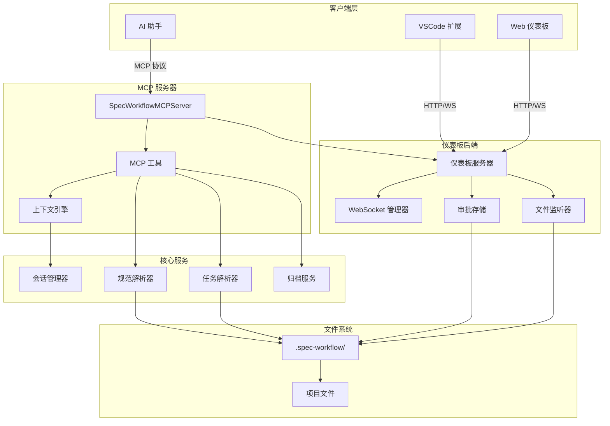
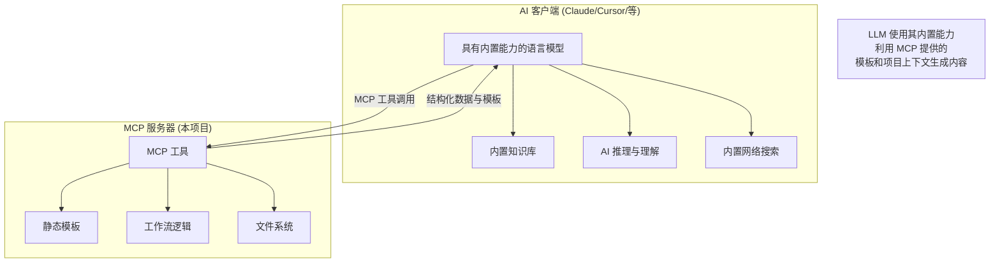
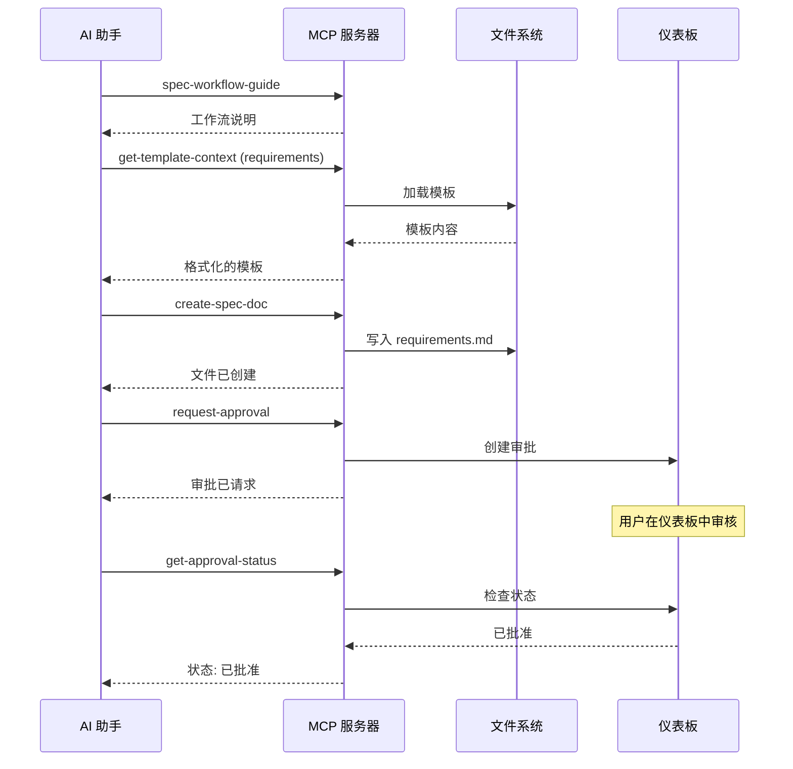
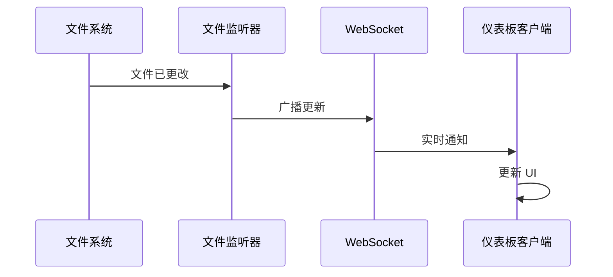

# 架构概览

> **TL;DR**: MCP 服务器，配备结构化工作流工具、实时仪表板和智能上下文管理。

## 🏗️ 系统架构

### 高层组件



## 🤖 AI 架构与集成模型

### 纯 MCP 服务器设计

这是一个**纯模型上下文协议 (MCP) 服务器**，通过结构化的工具交互利用连接的 LLM 的内置能力：



**关键架构原则:**

1. **利用 LLM 内置能力**: 使用连接的 AI 现有的知识、推理和搜索能力
2. **无独立外部调用**: MCP 服务器不进行独立的 API 调用（除 NPM 版本检查外）
3. **LLM 驱动的内容生成**: 连接的 LLM 使用其内置理解生成所有内容
4. **结构化工作流**: 提供模板并强制执行工作流，让 LLM 填充智能内容
5. **人工审批关卡**: 所有 LLM 生成的内容在继续前都需要人工审核

### 详细能力分析与扩展机会

| 能力 | 当前实现 | LLM 内置功能 | 潜在 MCP 增强 | 竞争分析 |
|------------|----------------------|---------------------|---------------------------|---------------------|
| **网页抓取与研究** | ❌ 无独立能力 | ✅ LLM 具有内置网络搜索 | 🔮 可添加：结构化网页抓取工具、API 集成、研究缓存 | 其他代理：自定义抓取器、API 包装器 |
| **AI 驱动的分析** | ❌ 无独立 AI 调用 | ✅ LLM 提供所有分析 | 🔮 可添加：专用分析工具、代码质量指标 | 其他代理：多 AI 模型集成 |
| **上下文窗口管理** | ❌ 无 LLM 上下文管理 | ✅ LLM 管理对话上下文 | 🔮 可添加：上下文优化、内存管理 | 其他代理：高级上下文策略 |
| **外部集成** | ❌ 仅 NPM 版本检查 | ✅ LLM 可调用外部 API | 🔮 可添加：GitHub 集成、CI/CD 钩子、数据库连接 | 其他代理：广泛的 API 生态系统 |
| **自动审查流程** | ❌ 仅人工审批 | ✅ LLM 可分析和审查 | 🔮 可添加：自动化质量关卡、AI 驱动的审批 | 其他代理：多阶段 AI 审查 |
| **最佳实践标准** | ❌ 仅静态模板 | ✅ LLM 具有当前最佳实践 | 🔮 可添加：动态模板更新、标准 API | 其他代理：实时标准数据库 |
| **规划与编排** | ❌ 固定工作流序列 | ✅ LLM 可规划和推理 | 🔮 可添加：动态工作流、自适应规划 | 其他代理：复杂编排引擎 |

### 竞争特性分析

**vs 传统开发工具:**
```typescript
interface CompetitiveAnalysis {
  specWorkflowMCP: {
    strengths: [
      "人工监督集成",
      "结构化工作流强制执行", 
      "实时仪表板监控",
      "LLM 驱动的智能内容"
    ];
    limitations: [
      "无独立网页抓取",
      "无自动 AI 审查",
      "固定工作流模板",
      "单项目范围"
    ];
  };
  
  competitorAgents: {
    strengths: [
      "多模型 AI 集成",
      "高级网页抓取能力", 
      "自动化质量保证",
      "动态工作流适配"
    ];
    limitations: [
      "较少人工监督",
      "复杂的设置要求",
      "更高的资源使用",
      "潜在失控行为"
    ];
  };
}
```

**扩展路线图洞察:**
```typescript
interface ExpansionOpportunities {
  phase1: {
    webIntegration: "添加 GitHub API、Jira 集成、Confluence 同步";
    smartTemplates: "基于项目类型检测的动态模板";
    qualityGates: "使用 LLM 的自动化代码质量分析";
  };
  
  phase2: {
    aiWorkflows: "LLM 驱动的自适应工作流生成";
    codeAnalysis: "深度代码库分析和重构建议";
    teamCollaboration: "多开发者协调和冲突解决";
  };
  
  phase3: {
    enterpriseFeatures: "SSO、审计跟踪、合规报告";
    aiOrchestration: "多代理协调和任务委派";
    predictiveAnalysis: "项目风险分析和时间线预测";
  };
}
```

### LLM 的内置能力当前如何被利用

| LLM 能力 | MCP 如何利用它 | 示例 | 扩展潜力 |
|---------------|---------------------|---------|-------------------|
| **内置知识** | LLM 将软件工程最佳实践应用于模板 | 填充设计模板时使用 SOLID 原则 | 🔮 动态最佳实践更新 |
| **推理与理解** | LLM 分析项目上下文并生成适当的内容 | 基于项目分析创建相关需求 | 🔮 高级项目风险评估 |
| **内置网络搜索** | LLM 可研究当前技术和实践 | 生成组件时查找最新的 React 模式 | 🔮 结构化研究缓存 |
| **代码理解** | LLM 分析提供上下文时的现有代码库 | 基于现有模式建议适当的 API 设计 | 🔮 自动重构建议 |
| **技术写作** | LLM 生成结构良好的技术文档 | 创建专业的需求和设计文档 | 🔮 多格式文档生成 |

### 上下文流架构

```typescript
// 上下文如何从项目文件流向 AI 客户端
interface ContextFlow {
  1: "AI 客户端通过 MCP 工具调用请求上下文";
  2: "MCP 服务器从 .spec-workflow/ 目录加载文件";
  3: "MCP 服务器使用模板和解析构造数据";
  4: "MCP 服务器将格式化的上下文返回给 AI 客户端";
  5: "AI 客户端在其推理和生成中使用上下文";
}
```

**重要**: MCP 服务器不会扩展 AI 客户端的上下文窗口 - 它提供 AI 客户端整合到自己的上下文管理中的结构化数据。

## 🔧 核心组件

### MCP 服务器 (`src/server.ts`)

编排所有功能的主服务器类：

```typescript
export class SpecWorkflowMCPServer {
  private server: Server;
  private dashboardServer?: DashboardServer;
  private sessionManager?: SessionManager;
}
```

**主要职责:**
- **工具注册**: 管理 13 个 MCP 工具
- **会话跟踪**: 监控仪表板连接
- **优雅关闭**: 处理客户端断开连接
- **上下文协调**: 为工具提供共享上下文

### 工具系统 (`src/tools/`)

实现带有结构化工具的模型上下文协议：

```typescript
// 工具类别
const tools = [
  // 工作流指南
  'spec-workflow-guide', 'steering-guide',
  
  // 文档创建  
  'create-spec-doc', 'create-steering-doc',
  
  // 上下文加载
  'get-spec-context', 'get-steering-context', 'get-template-context',
  
  // 状态管理
  'spec-list', 'spec-status', 'manage-tasks',
  
  // 审批工作流
  'request-approval', 'get-approval-status', 'delete-approval'
];
```

**工具架构模式:**
```typescript
export const toolNameTool: Tool = {
  name: 'tool-name',
  description: '带有使用说明的清晰描述',
  inputSchema: { /* JSON Schema 验证 */ }
};

export async function toolNameHandler(
  args: ValidatedArgs, 
  context: ToolContext
): Promise<ToolResponse> {
  // 实现
}
```

### 上下文引擎

高效令牌使用的智能上下文管理：

```typescript
interface ToolContext {
  projectPath: string;
  dashboardUrl?: string;
  sessionManager?: SessionManager;
}
```

**上下文策略:**
- **预加载**: 启动时缓存模板
- **延迟加载**: 按需加载规范  
- **缓存失效**: 文件更改时刷新内容
- **智能分块**: 适当分割大文档

## 🗂️ 数据流

### 1. 工作流创建流程



### 2. 实时仪表板更新



## 📁 文件系统组织

### 项目结构
```
project-root/
├── .spec-workflow/              # 所有工作流数据
│   ├── specs/                   # 规范
│   │   └── feature-name/        # 单个规范
│   │       ├── requirements.md  # 阶段 1
│   │       ├── design.md        # 阶段 2
│   │       └── tasks.md         # 阶段 3
│   ├── steering/                # 项目指导
│   │   ├── product.md           # 产品愿景
│   │   ├── tech.md              # 技术标准
│   │   └── structure.md         # 代码组织
│   ├── approvals/               # 审批工作流数据
│   │   └── spec-name/           # 每个规范的审批
│   └── session.json             # 活跃仪表板会话
└── [你的项目文件]               # 现有项目
```

### 目录职责

| 目录 | 用途 | 自动创建 |
|-----------|---------|--------------|
| `specs/` | 规范文档 | ✅ |  
| `steering/` | 项目指导 | ✅ |
| `approvals/` | 审批工作流 | 按需 |
| `archive/` | 已完成规范 | 按需 |

## 🌐 仪表板架构

### 后端 (`src/dashboard/server.ts`)

基于 Fastify 的服务器，支持 WebSocket：

```typescript
export class DashboardServer {
  private app: FastifyInstance;
  private watcher: SpecWatcher;
  private approvalStorage: ApprovalStorage;
  private clients: Set<WebSocket>;
}
```

**功能:**
- **静态文件服务**: 前端资源
- **WebSocket**: 实时更新
- **REST API**: CRUD 操作
- **文件监听**: 更改时自动刷新

### 前端 (`src/dashboard_frontend/`)

采用现代工具的 React 应用程序：

```
src/
├── modules/
│   ├── pages/           # 主应用程序页面
│   ├── components/      # 可复用 UI 组件  
│   ├── api/            # API 通信
│   └── ws/             # WebSocket 集成
├── main.tsx            # 应用程序入口点
└── App.tsx            # 根组件
```

**技术栈:**
- **React 18**: 组件框架
- **TypeScript**: 类型安全  
- **Vite**: 构建工具和开发服务器
- **Tailwind CSS**: 实用优先的样式
- **WebSocket**: 实时通信

## 🔄 状态管理

### 会话状态
- **服务器**: 跟踪活跃的仪表板 URL
- **客户端**: 维护到特定仪表板实例的连接
- **持久化**: `.spec-workflow/session.json`

### 审批状态  
- **存储**: `approvals/` 目录中的 JSON 文件
- **生命周期**: pending → approved/rejected → archived
- **同步**: 通过 WebSocket 实时更新

### 规范状态
- **解析**: 从 markdown 文件按需解析
- **缓存**: 内存中缓存，文件更改时失效  
- **分发**: 广播到连接的客户端

## 🚦 错误处理

### 工具错误响应模式
```typescript
interface ToolResponse {
  success: boolean;
  message: string;
  data?: any;
  nextSteps?: string[];
  projectContext?: {
    projectPath: string;
    workflowRoot: string;
    dashboardUrl?: string;
  };
}
```

### 错误类别
1. **验证错误**: 无效参数
2. **文件系统错误**: 权限、未找到
3. **网络错误**: 仪表板连接问题
4. **工作流错误**: 乱序操作

## ⚡ 性能与可扩展性

### 资源使用与限制

**内存消耗**:
```typescript
interface ResourceLimits {
  // 每个项目的内存使用
  templates: "~50KB (启动时缓存)";
  specContext: "每个规范 10-100KB";
  approvalData: "每个审批 1-5KB";
  sessionData: "每个项目 <1KB";
  
  // 推荐的项目限制
  maxSpecs: "每个项目 50-100 个规范";
  maxDocumentSize: "每个文档 200KB";
  maxProjectSize: "总 .spec-workflow/ 5-10MB";
  
  // 性能阈值
  contextLoadTime: "典型规范 <200ms";
  dashboardResponse: "API 调用 <50ms";
  fileWatcherDelay: "500ms 防抖";
}
```

**文件系统性能**:
- **模板加载**: <10ms (永久缓存)
- **规范上下文加载**: 冷启动 50-200ms，缓存 <5ms
- **仪表板 API 响应**: 典型 <50ms
- **文件监听器反应**: 500ms 防抖

### 可扩展性约束

**单项目限制**:
```bash
# 每个项目的推荐最大值
规范数: 50-100
每个规范的文档数: 3 (requirements, design, tasks)  
文档大小: 每个 200KB
项目总大小: 5-10MB
并发仪表板用户: 每个项目 1 个
文件监听深度: 仅 .spec-workflow/
```

**多项目扩展**:
- 每个项目运行独立的 MCP 服务器实例
- 项目之间无共享状态
- 线性扩展: N 个项目 = N 个服务器实例
- 内存使用随项目数量线性增长

### 性能优化策略

**文件系统优化**:
```typescript
// 已实现的优化
1. "模板预加载和永久缓存";
2. "规范上下文的 LRU 缓存 (最多 50 个条目)";
3. "防抖文件监听 (500ms)";
4. "审批数据的延迟加载";
5. "使用 PathUtils 高效路径解析";
```

**内存管理**:
```typescript
// 内存优化模式
interface MemoryOptimization {
  templateCache: "永久 - 小型静态数据";
  specCache: "LRU，50MB 限制";
  approvalStorage: "按需加载";
  sessionTracking: "仅最小元数据";
  
  cleanup: {
    specCacheEviction: "达到限制时 LRU";
    approvalCleanup: "审批后手动删除";
    sessionExpiry: "服务器重启时";
  };
}
```

## 🔒 安全考虑

### 文件系统访问
- **受限范围**: 仅 `.spec-workflow/` 目录  
- **路径验证**: 防止目录遍历
- **安全操作**: 无任意命令执行

### 网络安全
- **仅本地**: 仪表板绑定到 localhost
- **无外部调用**: 除版本检查外（可选）
- **输入验证**: 所有参数已清理

### 数据隐私
- **本地存储**: 所有数据保留在用户机器上
- **无遥测**: 不传输使用数据
- **会话隔离**: 每个项目有单独的会话

### 企业安全考虑

**网络安全**:
```typescript
interface NetworkSecurity {
  inboundConnections: "仅 localhost 仪表板 (端口 3456)";
  outboundConnections: "仅 NPM 注册表版本检查";
  dataTransmission: "无外部数据传输";
  tlsCertificates: "不需要 - 仅 localhost";
  firewall: "允许 localhost:3456 用于仪表板访问";
}
```

**数据治理**:
```typescript
interface DataGovernance {
  dataLocation: "所有数据在项目 .spec-workflow/ 目录中";
  dataRetention: "手动 - 用户控制所有数据生命周期";
  dataDeletion: "rm -rf .spec-workflow/ 删除所有 MCP 数据";
  auditTrail: "文件系统时间戳，无应用程序日志";
  compliance: "无数据离开本地机器（除版本检查外）";
}
```

**访问控制**:
- **文件系统**: 使用 OS 文件权限
- **仪表板**: 无身份验证 - 仅 localhost 访问  
- **VS Code**: 与 VS Code 用户会话集成
- **多用户**: 不为多用户环境设计

**企业部署考虑**:
```bash
# 企业防火墙规则
允许出站: registry.npmjs.org (443) # 仅版本检查
允许入站: 无需要
允许 localhost: 3456 (仪表板), 动态端口 (MCP)

# 安全扫描
静态分析: TypeScript 代码库，无二进制依赖
漏洞扫描: NPM 审计，无外部服务
数据分类: 所有数据用户控制，仅本地存储
```

---

**下一步**: [MCP 工具 API 参考 →](api-reference.md)

