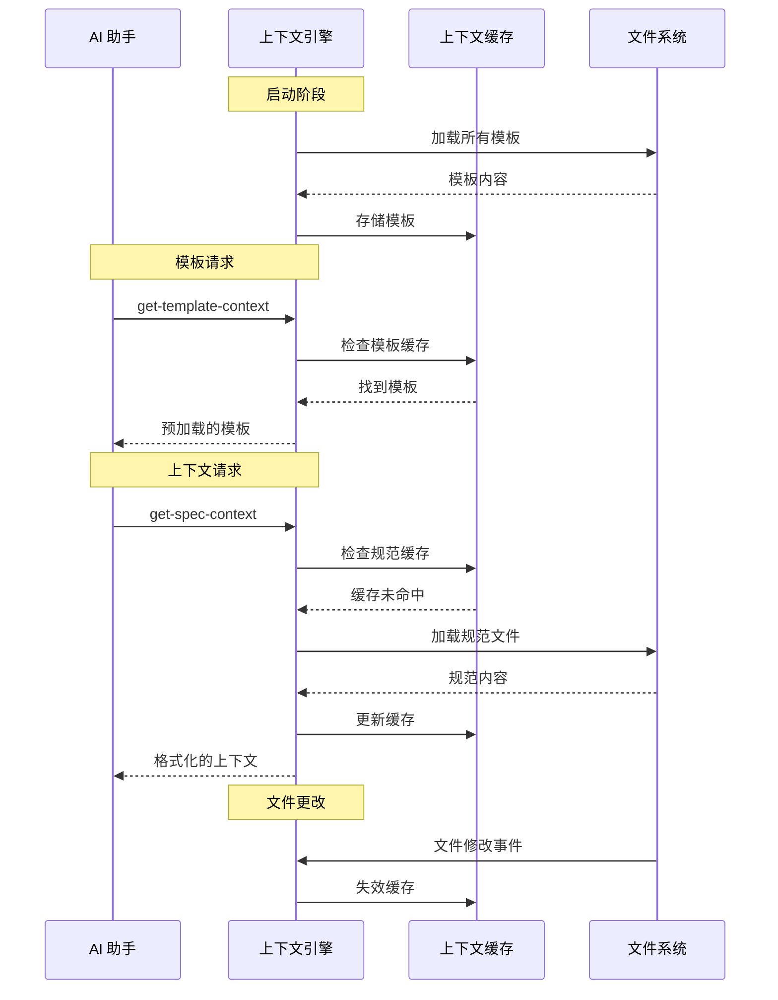
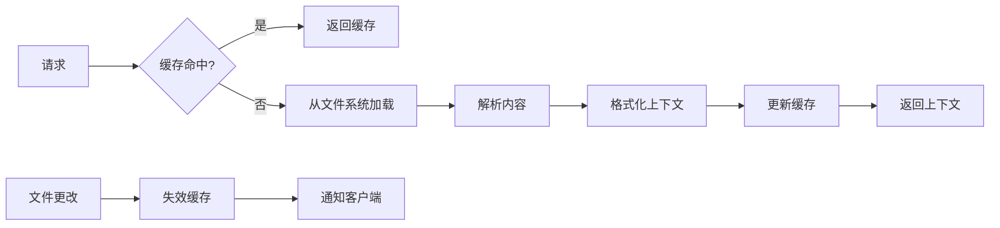

# 上下文管理

> **TL;DR**: 智能上下文加载、缓存和切换，以优化令牌使用和性能。

## 🧠 上下文策略概览

MCP 服务器实现智能上下文管理，以最小化令牌使用，同时在每个工作流阶段提供相关信息。

**关键区别**: 此 MCP 不管理 AI 客户端上下文窗口或对话历史。它构建和提供 AI 客户端整合到其自己的上下文管理中的项目数据。

### 此 MCP 做什么与不做什么

| 上下文管理方面 | 此 MCP 服务器 | AI 客户端 (Claude/Cursor) |
|---------------------------|-----------------|---------------------------|
| **上下文窗口管理** | ❌ 不管理 | ✅ 管理对话上下文 |
| **内存/历史存储** | ❌ 无对话内存 | ✅ 维护对话历史 |
| **令牌优化** | ✅ 高效数据结构化 | ✅ 上下文窗口优化 |
| **项目数据加载** | ✅ 加载和结构化文件 | ❌ 接收结构化数据 |
| **模板缓存** | ✅ 缓存静态模板 | ❌ 处理提供的模板 |
| **跨会话持久化** | ✅ 文件中的项目状态 | ✅ 对话状态管理 |

### 核心原则
1. **预加载模板** - 加载一次，到处重用
2. **延迟加载内容** - 仅在需要时加载规范
3. **上下文分块** - 将大文档分解为可管理的片段
4. **缓存失效** - 文件更改时刷新内容
5. **阶段感知上下文** - 不同工作流阶段的不同上下文

## 🔄 上下文流程图



## 📊 上下文类型

### 1. 模板上下文

**用途**: 提供文档结构和格式指南

**加载策略**: 启动时预加载，永久缓存

```typescript
interface TemplateContext {
  templateType: 'spec' | 'steering';
  template: string;
  content: string;
  loaded: string;
}
```

**可用模板**:
- **规范模板**: `requirements`, `design`, `tasks`
- **指导模板**: `product`, `tech`, `structure`

**缓存键**: `template:${templateType}:${template}`

**内存使用**: 所有模板总共约 50KB

---

### 2. 规范上下文

**用途**: 加载现有规范文档以进行实现

**加载策略**: 延迟加载，智能缓存

```typescript
interface SpecContext {
  specName: string;
  documents: {
    requirements: boolean;
    design: boolean;
    tasks: boolean;
  };
  context: string;        // 格式化的内容
  sections: number;
  specPath: string;
}
```

**上下文格式**:
```markdown
## 规范上下文（已预加载）: user-authentication

### 需求
[需求内容...]

---

### 设计  
[设计内容...]

---

### 任务
[任务内容...]

**注意**: 规范文档已预加载。不要再次使用 get-content 获取它们。
```

**缓存策略**:
- **键**: `spec:${projectPath}:${specName}`
- **TTL**: 直到检测到文件修改
- **大小限制**: 每个规范上下文 100KB
- **驱逐**: 达到内存限制时 LRU

---

### 3. 指导上下文

**用途**: 提供项目指南和架构上下文

**加载策略**: 首次请求时预加载，缓存直到文件更改

```typescript
interface SteeringContext {
  documents: {
    product: boolean;
    tech: boolean; 
    structure: boolean;
  };
  context: string;        // 组合格式化内容
  sections: number;
}
```

**上下文格式**:
```markdown
## 指导文档上下文（已预加载）

### 产品上下文
[产品文档内容...]

---

### 技术上下文
[技术文档内容...]

---

### 结构上下文
[结构文档内容...]

**注意**: 指导文档已预加载。不要再次使用 get-content 获取它们。
```

**缓存策略**:
- **键**: `steering:${projectPath}`
- **TTL**: 直到任何指导文件更改
- **大小限制**: 总共 200KB
- **共享**: 在项目中所有规范之间共享

## 🚀 性能优化

### 上下文分块策略

大文档被智能分割以优化令牌使用：

```typescript
interface ChunkingStrategy {
  maxChunkSize: 2000;          // 每块字符数
  preserveMarkdown: true;       // 保持 markdown 结构完整
  smartBreaks: true;           // 在逻辑点（标题、章节）断开
  overlap: 100;               // 块之间的字符重叠
}
```

**分块算法**:
1. **识别断点**: 标题、水平线、代码块
2. **大小检查**: 如果章节 > maxChunkSize，在段落断点处分割
3. **保持结构**: 保持 markdown 格式完整
4. **添加上下文**: 在每个块中包含章节标题

### 缓存架构

```typescript
interface ContextCache {
  templates: Map<string, TemplateData>;     // 永久缓存
  specs: LRUCache<string, SpecContext>;     // 最多 50 个条目
  steering: Map<string, SteeringContext>;   // 每个项目的缓存
  sessions: Map<string, SessionData>;       // 活跃会话
}
```

**缓存级别**:
1. **L1 - 内存缓存**: 热数据，即时访问
2. **L2 - 文件系统**: 已解析的内容缓存
3. **L3 - 源文件**: 原始 markdown 文件

**缓存失效触发器**:
- 文件修改事件
- 手动缓存清除请求
- 内存压力（LRU 驱逐）
- 服务器重启

## 📁 上下文文件管理

### 文件监听

系统监视 `.spec-workflow/` 目录的更改：

```typescript
class FileWatcher {
  private watcher: FSWatcher;
  
  constructor(projectPath: string) {
    this.watcher = chokidar.watch(
      join(projectPath, '.spec-workflow'),
      {
        ignored: /(^|[\/\\])\../,  // 忽略隐藏文件
        persistent: true,
        ignoreInitial: true
      }
    );
    
    this.watcher.on('change', this.handleFileChange.bind(this));
    this.watcher.on('add', this.handleFileAdd.bind(this));
    this.watcher.on('unlink', this.handleFileDelete.bind(this));
  }
  
  private async handleFileChange(filePath: string) {
    // 失效相关缓存
    // 通知连接的客户端
    // 如需要触发重新解析
  }
}
```

**监听路径**:
- `.spec-workflow/specs/**/*.md` - 规范文档
- `.spec-workflow/steering/*.md` - 指导文档  
- `.spec-workflow/session.json` - 会话跟踪

### 上下文加载流水线



## 🎯 上下文切换逻辑

### 基于阶段的上下文加载

不同的工作流阶段需要不同的上下文：

```typescript
interface PhaseContext {
  phase: 'requirements' | 'design' | 'tasks' | 'implementation';
  requiredContext: ContextType[];
  optionalContext: ContextType[];
  maxTokens: number;
}

const phaseContextMap: Record<string, PhaseContext> = {
  requirements: {
    phase: 'requirements',
    requiredContext: ['template:spec:requirements'],
    optionalContext: ['steering:product', 'steering:tech'],
    maxTokens: 8000
  },
  
  design: {
    phase: 'design', 
    requiredContext: ['template:spec:design', 'spec:requirements'],
    optionalContext: ['steering:tech', 'steering:structure'],
    maxTokens: 12000
  },
  
  tasks: {
    phase: 'tasks',
    requiredContext: ['template:spec:tasks', 'spec:design'],
    optionalContext: ['spec:requirements'],
    maxTokens: 10000
  },
  
  implementation: {
    phase: 'implementation',
    requiredContext: ['spec:tasks'],
    optionalContext: ['spec:requirements', 'spec:design'],
    maxTokens: 15000
  }
};
```

### 智能上下文选择

上下文引擎基于以下内容选择最优上下文：

1. **当前阶段**: 需求 vs 设计 vs 任务 vs 实现
2. **可用上下文**: 已缓存或快速访问的内容  
3. **令牌预算**: 上下文可用的最大令牌
4. **相关性分数**: 上下文与当前任务的相关程度

```typescript
class ContextSelector {
  selectOptimalContext(
    phase: string,
    available: ContextItem[], 
    tokenBudget: number
  ): ContextItem[] {
    const phaseConfig = phaseContextMap[phase];
    const selected: ContextItem[] = [];
    let usedTokens = 0;
    
    // 始终包含必需的上下文
    for (const required of phaseConfig.requiredContext) {
      const context = available.find(c => c.key === required);
      if (context && usedTokens + context.tokens <= tokenBudget) {
        selected.push(context);
        usedTokens += context.tokens;
      }
    }
    
    // 按相关性分数添加可选上下文
    const optional = available
      .filter(c => phaseConfig.optionalContext.includes(c.key))
      .sort((a, b) => b.relevanceScore - a.relevanceScore);
    
    for (const context of optional) {
      if (usedTokens + context.tokens <= tokenBudget) {
        selected.push(context);
        usedTokens += context.tokens;
      }
    }
    
    return selected;
  }
}
```

## 🔧 实现细节

### 上下文引擎核心

```typescript
export class ContextEngine {
  private cache: ContextCache;
  private watcher: FileWatcher;
  private selector: ContextSelector;
  
  constructor(projectPath: string) {
    this.cache = new ContextCache();
    this.watcher = new FileWatcher(projectPath);  
    this.selector = new ContextSelector();
    
    // 预加载模板
    this.preloadTemplates();
  }
  
  async getSpecContext(
    projectPath: string,
    specName: string
  ): Promise<SpecContext> {
    const cacheKey = `spec:${projectPath}:${specName}`;
    
    // 首先检查缓存
    let context = this.cache.specs.get(cacheKey);
    if (context) {
      return context;
    }
    
    // 从文件系统加载
    context = await this.loadSpecFromFS(projectPath, specName);
    
    // 缓存结果
    this.cache.specs.set(cacheKey, context);
    
    return context;
  }
  
  private async loadSpecFromFS(
    projectPath: string,
    specName: string
  ): Promise<SpecContext> {
    const specPath = PathUtils.getSpecPath(projectPath, specName);
    const documents = { requirements: false, design: false, tasks: false };
    const sections: string[] = [];
    
    // 加载每个文档
    for (const doc of ['requirements', 'design', 'tasks']) {
      const filePath = join(specPath, `${doc}.md`);
      try {
        const content = await readFile(filePath, 'utf-8');
        if (content.trim()) {
          sections.push(`### ${doc.charAt(0).toUpperCase() + doc.slice(1)}\n${content.trim()}`);
          documents[doc as keyof typeof documents] = true;
        }
      } catch {
        // 文件不存在，跳过
      }
    }
    
    const formattedContext = sections.length > 0
      ? `## 规范上下文（已预加载）: ${specName}\n\n${sections.join('\n\n---\n\n')}\n\n**注意**: 规范文档已预加载。不要再次使用 get-content 获取它们。`
      : `## 规范上下文\n\n未找到规范文档: ${specName}`;
    
    return {
      specName,
      documents,
      context: formattedContext,
      sections: sections.length,
      specPath
    };
  }
}
```

### 内存管理

```typescript
interface MemoryConfig {
  maxCacheSize: 50 * 1024 * 1024;      // 50MB 总缓存
  maxSpecContexts: 50;                  // 最多缓存的规范上下文
  templateCacheLimit: 10 * 1024 * 1024; // 10MB 用于模板
  cleanupInterval: 300000;              // 5 分钟
}

class MemoryManager {
  private config: MemoryConfig;
  private cleanupTimer: NodeJS.Timeout;
  
  constructor() {
    this.config = { /* config */ };
    this.scheduleCleanup();
  }
  
  private scheduleCleanup() {
    this.cleanupTimer = setInterval(() => {
      this.performCleanup();
    }, this.config.cleanupInterval);
  }
  
  private performCleanup() {
    // 删除陈旧的缓存条目
    // 如需要压缩上下文
    // 记录内存使用
  }
}
```

## 📈 性能指标

### 上下文加载性能

**模板加载** (启动时):
- **时间**: 所有模板 < 10ms
- **内存**: 总共约 50KB
- **缓存命中率**: 100% (永久缓存)

**规范上下文加载** (按需):
- **冷加载**: 50-200ms，取决于文档大小  
- **热加载**: 从缓存 < 5ms
- **内存**: 每个规范上下文 10-100KB
- **缓存命中率**: 典型使用约 85%

**指导上下文加载** (每个项目的首次请求):
- **时间**: 20-100ms，取决于文档数量
- **内存**: 每个项目 50-200KB
- **缓存命中率**: 首次加载后约 90%

### 令牌使用优化

**上下文管理前**:
- 每个请求平均令牌: 15,000-25,000
- 上下文冗余: 40-60%
- 缓存未命中率: 95%

**上下文管理后**:
- 每个请求平均令牌: 8,000-12,000  
- 上下文冗余: 5-10%
- 缓存未命中率: 10-15%

**改进**: 令牌使用约减少 50%

---

**下一步**: [故障排除与 FAQ →](troubleshooting.md)

