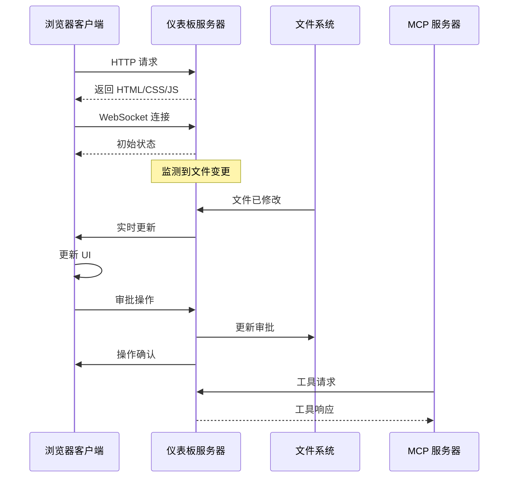

# 仪表板系统

> **TL;DR**: 实时 Web 仪表板，用于监控规范、管理审批与跟踪进度。

## 🌐 仪表板概览

仪表板提供如下 Web 界面能力：
- **规范管理** - 查看、创建与组织规范
- **审批工作流** - 审阅并批准文档  
- **任务跟踪** - 监控实现进度
- **实时更新** - 通过 WebSocket 实时同步
- **文档查看** - 浏览带语法高亮的 Markdown 文档

## 🏗️ 架构

### 前端栈
- **React 18** - 组件框架与 hooks
- **TypeScript** - 类型安全开发
- **Tailwind CSS** - 实用优先的样式
- **Vite** - 快速构建与开发服务器
- **React Router** - 客户端路由

### 后端栈
- **Fastify** - 高性能 Web 服务器
- **WebSocket** - 实时通信
- **Chokidar** - 文件系统监听
- **Markdown-it** - Markdown 解析与渲染

### 通信流程



## 🚀 启动仪表板

### 独立模式
```bash
# 仅仪表板（不启动 MCP 服务器）
npx -y @pimzino/spec-workflow-mcp@latest --dashboard

# 自定义端口
npx -y @pimzino/spec-workflow-mcp@latest --dashboard --port 8080

# 指定项目目录启动
cd /path/to/project
npx -y @pimzino/spec-workflow-mcp@latest --dashboard
```

### 随 MCP 服务器自动启动
```json
{
  "mcpServers": {
    "spec-workflow": {
      "command": "npx",
      "args": ["-y", "@pimzino/spec-workflow-mcp@latest", "/project/path", "--AutoStartDashboard"]
    }
  }
}
```

### 开发模式
```bash
# 启动仪表板开发服务器（热重载）
npm run dev:dashboard

# 前端访问 http://localhost:5173
# 后端连接 http://localhost:3456
```

## 📱 用户界面

### 主导航

```
┌─────────────────────────────────────┐
│ Spec Workflow Dashboard             │
├─────────────────────────────────────┤
│ 📋 Specs      │ Main Content Area   │
│ 📝 Steering   │                     │
│ ✅ Approvals  │                     │  
│ 📊 Tasks      │                     │
│ 📈 Statistics │                     │
└─────────────────────────────────────┘
```

### 页面组件

#### 规范页面（`SpecsPage.tsx`）
```typescript
interface SpecsPageProps {
  specs: SpecData[];
  onSpecSelect: (spec: SpecData) => void;
}

// 特性：
// - 列出所有规范
// - 显示状态（not-started, in-progress, ready, implementing, completed）
// - 任务完成进度条
// - 快捷操作（查看、归档、删除）
```

#### 审批页面（`ApprovalsPage.tsx`）
```typescript
interface ApprovalsPageProps {
  approvals: ApprovalData[];
  onApprovalAction: (id: string, action: 'approve' | 'reject') => void;
}

// 特性：
// - 待审批列表
// - 文档预览（语法高亮）
// - 通过/拒绝并添加评论
// - 实时状态更新
```

#### 规范查看器（`SpecViewerPage.tsx`）
```typescript
interface SpecViewerProps {
  specName: string;
  documents: SpecDocuments;
}

// 特性：
// - 标签页（Requirements, Design, Tasks）
// - Markdown 渲染与代码高亮
// - 任务状态指示
// - 文档元信息（创建、修改、状态）
```

#### 任务页面（`TasksPage.tsx`）
```typescript
interface TasksPageProps {
  tasks: TaskData[];
  onTaskUpdate: (taskId: string, status: TaskStatus) => void;
}

// 特性：
// - 任务列表与状态指示
// - 按规范跟踪进度
// - 按状态筛选（pending, in-progress, completed）
// - 批量任务操作
```

## 🔄 实时能力

### WebSocket 集成

**连接设置**：
```typescript
// src/dashboard_frontend/src/modules/ws/WebSocketProvider.tsx
const WebSocketProvider = ({ children }: { children: React.ReactNode }) => {
  const [socket, setSocket] = useState<WebSocket | null>(null);
  const [message, setMessage] = useState<any>(null);
  
  useEffect(() => {
    const ws = new WebSocket('ws://localhost:3456/ws');
    
    ws.onmessage = (event) => {
      const data = JSON.parse(event.data);
      setMessage(data);
    };
    
    ws.onopen = () => {
      console.log('WebSocket connected');
    };
    
    ws.onerror = (error) => {
      console.error('WebSocket error:', error);
    };
    
    setSocket(ws);
    
    return () => {
      ws.close();
    };
  }, []);
  
  return (
    <WebSocketContext.Provider value={{ socket, message }}>
      {children}
    </WebSocketContext.Provider>
  );
};
```

**消息类型**：
```typescript
interface WebSocketMessage {
  type: 'initial' | 'specs-updated' | 'approval-updated' | 'task-updated';
  data: any;
  timestamp: string;
}

// 示例消息
const messages = {
  initial: {
    type: 'initial',
    data: { specs: [], approvals: [] }
  },
  
  specsUpdated: {
    type: 'specs-updated', 
    data: { specs: [/* updated specs */] }
  },
  
  approvalUpdated: {
    type: 'approval-updated',
    data: { approvalId: '...', status: 'approved' }
  }
};
```

### 文件监听

**后端文件监听器**：
```typescript
// src/dashboard/watcher.ts
export class SpecWatcher {
  private watcher: FSWatcher;
  
  constructor(projectPath: string, parser: SpecParser) {
    this.watcher = chokidar.watch(
      join(projectPath, '.spec-workflow'),
      {
        ignored: /(^|[\/\\])\../, // 忽略隐藏文件
        persistent: true,
        ignoreInitial: true
      }
    );
    
    this.watcher.on('change', async (filePath) => {
      // 仅重新解析受影响的规范（示例为全量）
      const specs = await parser.getAllSpecs();
      // 向所有连接客户端广播
      this.broadcastUpdate('specs-updated', { specs });
    });
  }
  
  private broadcastUpdate(type: string, data: any) {
    const message = JSON.stringify({ type, data, timestamp: new Date().toISOString() });
    this.clients.forEach(client => {
      if (client.readyState === WebSocket.OPEN) {
        client.send(message);
      }
    });
  }
}
```

## 🎨 样式与主题

### 主题系统

**Theme Provider**：
```typescript
// src/dashboard_frontend/src/modules/theme/ThemeProvider.tsx
const ThemeProvider = ({ children }: { children: React.ReactNode }) => {
  const [theme, setTheme] = useState<'light' | 'dark'>('light');
  
  useEffect(() => {
    // 自动检测系统主题
    const mediaQuery = window.matchMedia('(prefers-color-scheme: dark)');
    setTheme(mediaQuery.matches ? 'dark' : 'light');
    
    mediaQuery.addEventListener('change', (e) => {
      setTheme(e.matches ? 'dark' : 'light');
    });
  }, []);
  
  return (
    <div className={theme === 'dark' ? 'dark' : ''}>
      {children}
    </div>
  );
};
```

**调色板**：
```css
/* src/dashboard_frontend/src/modules/theme/theme.css */
:root {
  /* 浅色主题 */
  --color-primary: #3b82f6;
  --color-secondary: #64748b;  
  --color-success: #10b981;
  --color-warning: #f59e0b;
  --color-error: #ef4444;
  --color-background: #ffffff;
  --color-surface: #f8fafc;
  --color-text: #1f2937;
}

.dark {
  /* 深色主题 */
  --color-primary: #60a5fa;
  --color-secondary: #94a3b8;
  --color-success: #34d399; 
  --color-warning: #fbbf24;
  --color-error: #f87171;
  --color-background: #1f2937;
  --color-surface: #374151;
  --color-text: #f9fafb;
}
```

### 组件样式

**Tailwind 配置**：
```javascript
// tailwind.config.js
module.exports = {
  content: ['./src/**/*.{js,ts,jsx,tsx}'],
  darkMode: 'class',
  theme: {
    extend: {
      colors: {
        primary: 'var(--color-primary)',
        secondary: 'var(--color-secondary)',
        success: 'var(--color-success)',
        warning: 'var(--color-warning)',
        error: 'var(--color-error)',
        background: 'var(--color-background)',
        surface: 'var(--color-surface)',
        text: 'var(--color-text)'
      }
    }
  }
};
```

## 🔧 后端 API

### REST Endpoints

```typescript
// 主要 API 路由
const routes = {
  // 规范
  'GET /api/specs': '列出所有规范',
  'GET /api/specs/:name': '获取指定规范详情',
  'PUT /api/specs/:name': '更新规范元数据',
  'DELETE /api/specs/:name': '删除规范',
  
  // 审批
  'GET /api/approvals': '列出待审批',
  'GET /api/approvals/:id': '获取审批详情',
  'POST /api/approvals/:id/approve': '批准文档',
  'POST /api/approvals/:id/reject': '带备注拒绝',
  'DELETE /api/approvals/:id': '删除审批',
  
  // 任务
  'GET /api/tasks/:specName': '获取指定规范的任务',
  'PUT /api/tasks/:specName/:taskId': '更新任务状态',
  
  // 系统
  'GET /api/health': '健康检查',
  'GET /api/version': '获取服务器版本信息'
};
```

**API 实现示例**：
```typescript
// src/dashboard/server.ts
export class DashboardServer {
  private async setupRoutes() {
    // 获取所有规范
    this.app.get('/api/specs', async (request, reply) => {
      try {
        const specs = await this.parser.getAllSpecs();
        reply.send({ success: true, data: specs });
      } catch (error) {
        reply.status(500).send({ success: false, error: (error as Error).message });
      }
    });
    
    // 批准文档
    this.app.post('/api/approvals/:id/approve', async (request, reply) => {
      try {
        const { id } = request.params as { id: string };
        await this.approvalStorage.approveDocument(id);
        
        // 广播更新
        this.broadcastToClients('approval-updated', { approvalId: id, status: 'approved' });
        
        reply.send({ success: true });
      } catch (error) {
        reply.status(500).send({ success: false, error: (error as Error).message });
      }
    });
  }
}
```

## 📊 性能优化

### 前端优化

**React 优化**：
```typescript
// 记忆化处理开销较大的组件
const SpecsList = React.memo(({ specs }: { specs: SpecData[] }) => {
  return (
    <div>
      {specs.map(spec => (
        <SpecCard key={spec.name} spec={spec} />
      ))}
    </div>
  );
});

// 大列表虚拟化
import { FixedSizeList as List } from 'react-window';

const VirtualizedTaskList = ({ tasks }: { tasks: TaskData[] }) => {
  return (
    <List
      height={400}
      itemCount={tasks.length}
      itemSize={60}
      itemData={tasks}
    >
      {TaskRow}
    </List>
  );
};
```

**懒加载**：
```typescript
// 页面代码分割
const SpecsPage = lazy(() => import('./modules/pages/SpecsPage'));
const ApprovalsPage = lazy(() => import('./modules/pages/ApprovalsPage'));

// Suspense 边界
<Suspense fallback={<LoadingSpinner />}>
  <Routes>
    <Route path="/specs" element={<SpecsPage />} />
    <Route path="/approvals" element={<ApprovalsPage />} />
  </Routes>
</Suspense>
```

### 后端优化

**响应缓存**：
```typescript
// 缓存高频访问数据
class ResponseCache {
  private cache = new Map<string, { data: any; timestamp: number }>();
  private ttl = 30000; // 30 秒
  
  get(key: string) {
    const entry = this.cache.get(key);
    if (entry && Date.now() - entry.timestamp < this.ttl) {
      return entry.data;
    }
    this.cache.delete(key);
    return null;
  }
  
  set(key: string, data: any) {
    this.cache.set(key, { data, timestamp: Date.now() });
  }
}
```

**高效文件监听**：
```typescript
// 防抖处理文件变更
import { debounce } from 'lodash';

const debouncedUpdate = debounce(async (filePath: string) => {
  // 仅重新解析受影响的规范
  const affectedSpecs = await this.getAffectedSpecs(filePath);
  const updatedSpecs = await this.parser.parseSpecs(affectedSpecs);
  this.broadcastUpdate('specs-updated', { specs: updatedSpecs });
}, 500);
```

## 🐛 仪表板问题调试

### 开发工具

**浏览器 DevTools 清单**：
1. **Console** - 检查 JavaScript 错误
2. **Network** - 验证 API 请求与 WebSocket 连接
3. **Application** - 检查 localStorage 与会话数据
4. **Elements** - 检查 DOM 与 CSS 问题

**常用调试命令**：
```javascript
// 在浏览器控制台

// 检查 WebSocket 连接
console.log('WebSocket state:', window.WebSocket.READY_STATE);

// 测试 API 接口
fetch('/api/specs').then(r => r.json()).then(console.log);

// 检查 React DevTools
window.React = React; // 启用 React DevTools
```

### 后端调试

**服务器日志**：
```bash
# 启用调试日志
DEBUG=dashboard:* npm run dev:dashboard

# 指定模块调试
DEBUG=dashboard:server,dashboard:watcher npm run dev:dashboard
```

**API 测试**：
```bash
# 直接测试端点
curl -X GET http://localhost:3456/api/specs
curl -X GET http://localhost:3456/api/health
curl -X POST http://localhost:3456/api/approvals/test-id/approve
```

---

**下一步**: [贡献指南 →](contributing.md)


