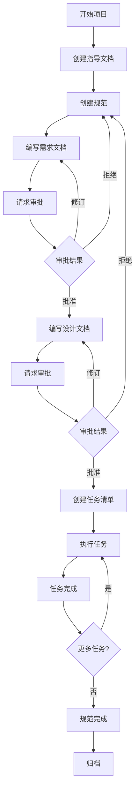

# Spec Workflow MCP 项目详细分析文档

## 📋 项目概述

### 基本信息

- **项目名称**: @pimzino/spec-workflow-mcp
- **版本**: v1.0.1
- **描述**: 基于 Model Context Protocol (MCP) 的规范驱动开发工作流服务器，提供实时 Web Dashboard 和 VSCode 扩展支持
- **许可证**: GPL-3.0
- **仓库**: https://github.com/Pimzino/spec-workflow-mcp

### 核心价值

这是一个专为 AI 辅助开发设计的工作流管理系统，通过结构化的规范文档和任务管理，帮助开发团队在与 AI（如 Claude、Cursor 等）协作时保持项目的一致性和可追踪性。

### 主要特性

1. **结构化开发工作流** - 遵循 需求(Requirements) → 设计(Design) → 任务(Tasks) 的顺序化流程
2. **实时 Web Dashboard** - 提供可视化的项目监控、规范查看和进度跟踪
3. **VSCode 扩展集成** - 在 VSCode 侧边栏直接访问 Dashboard 功能
4. **完善的审批工作流** - 支持文档审批、修订请求和版本追踪
5. **任务进度跟踪** - 可视化的进度条和详细的任务状态管理
6. **多语言支持** - 支持 11 种语言（英语、日语、中文、西班牙语、葡萄牙语、德语、法语、俄语、意大利语、韩语、阿拉伯语）

---

## 🛠 技术栈详解

### 后端技术栈

#### 核心框架与运行时
- **Node.js** - 运行时环境
- **TypeScript 5.7.2** - 开发语言（启用严格模式）
  - 目标: ES2022
  - 模块系统: Node16
  - 包含源映射、类型声明等完整配置

#### MCP 协议层
- **@modelcontextprotocol/sdk ^0.5.0** - Model Context Protocol SDK
  - 提供与 AI 客户端（Claude、Cursor 等）的标准化通信协议
  - 支持工具调用、提示管理等功能

#### Web 服务框架
- **Fastify ^4.24.3** - 高性能 Web 框架
  - 比 Express 更快的性能
  - 完善的类型支持
- **@fastify/static ^7.0.4** - 静态文件服务
- **@fastify/websocket ^8.2.1** - WebSocket 支持（用于实时更新）

#### 工具库
- **chokidar ^3.5.3** - 文件系统监听
- **simple-git ^3.28.0** - Git 操作集成
- **toml ^3.0.0** - TOML 配置文件解析
- **markdown-it ^14.1.0** - Markdown 解析
- **diff ^5.1.0** - 文本差异对比

### 前端技术栈

#### 核心框架
- **React 18.3.1** + **React DOM 18.3.1** - UI 框架
- **Vite 5.4.8** - 构建工具
  - 快速的开发服务器
  - 优化的生产构建
  - 支持 HMR（热模块替换）

#### 样式方案
- **TailwindCSS 4.1.13** - 原子化 CSS 框架
  - @tailwindcss/vite - Vite 插件
  - @tailwindcss/typography - 排版插件
- **tailwind-merge ^3.3.1** - 类名合并工具
- **class-variance-authority ^0.7.1** - 变体管理
- **clsx ^2.1.1** - 条件类名工具

#### UI 组件库
- **React Router DOM ^6.26.2** - 路由管理
- **@dnd-kit** - 拖拽功能
  - @dnd-kit/core ^6.1.0
  - @dnd-kit/sortable ^8.0.0
  - @dnd-kit/utilities ^3.2.2

#### 数据可视化
- **highlight.js ^11.9.0** - 代码高亮
- **mermaid ^10.9.1** - 图表渲染

#### 国际化
- **i18next ^25.5.2** - 国际化框架
- **react-i18next ^15.7.3** - React 绑定
- **i18next-browser-languagedetector ^8.2.0** - 语言检测

### VSCode 扩展技术栈

#### 核心依赖
- **VSCode API ^1.99.0** - VSCode 扩展 API
- **React 19.1.1** - Webview UI 框架
- **esbuild ^0.25.0** - 扩展代码打包

#### UI 组件
- **@radix-ui/react-*** - 无样式组件库
  - accordion, dropdown-menu, progress, select, separator, slot, tabs
- **lucide-react ^0.468.0** - 图标库
- **@jaames/iro ^5.5.2** - 颜色选择器

### 开发工具链

#### 构建与打包
- **tsx ^4.7.0** - TypeScript 执行器（开发模式）
- **rimraf ^6.0.1** - 跨平台文件删除
- **vite** - 前端构建
- **esbuild** - 扩展打包

#### 测试框架
- **vitest ^2.1.8** - 单元测试框架
- **@vitest/coverage-v8 ^2.1.8** - 测试覆盖率

#### 类型定义
- @types/node
- @types/react
- @types/react-dom
- @types/diff
- @types/ws

---

## 📁 项目结构详解

### 目录树概览

```
lls-spec-mcp/
├── src/                           # 主要源代码目录
│   ├── index.ts                   # 入口文件（CLI）
│   ├── server.ts                  # MCP 服务器实现
│   ├── config.ts                  # 配置管理
│   ├── types.ts                   # 类型定义
│   │
│   ├── core/                      # 核心服务层
│   │   ├── archive-service.ts     # 归档服务（规范归档）
│   │   ├── parser.ts              # 规范文档解析器
│   │   ├── path-utils.ts          # 路径工具
│   │   ├── session-manager.ts     # 会话管理
│   │   ├── task-parser.ts         # 任务解析器
│   │   └── workspace-initializer.ts # 工作区初始化
│   │
│   ├── tools/                     # MCP 工具定义
│   │   ├── index.ts               # 工具注册
│   │   ├── spec-workflow-guide.ts # 工作流指南工具
│   │   ├── steering-guide.ts      # 指导文档工具
│   │   ├── spec-status.ts         # 规范状态工具
│   │   └── approvals.ts           # 审批工具
│   │
│   ├── prompts/                   # AI 提示词模板
│   │   ├── index.ts               # 提示词注册
│   │   ├── create-spec.ts         # 创建规范提示词
│   │   ├── create-steering-doc.ts # 创建指导文档提示词
│   │   ├── implement-task.ts      # 实现任务提示词
│   │   ├── inject-spec-workflow-guide.ts
│   │   ├── inject-steering-guide.ts
│   │   ├── refresh-tasks.ts
│   │   ├── spec-status.ts
│   │   └── types.ts
│   │
│   ├── markdown/                  # Markdown 模板
│   │   └── templates/
│   │       ├── requirements-template.md
│   │       ├── design-template.md
│   │       ├── tasks-template.md
│   │       ├── product-template.md
│   │       ├── tech-template.md
│   │       └── structure-template.md
│   │
│   ├── dashboard/                 # Dashboard 后端
│   │   ├── server.ts              # Fastify 服务器
│   │   ├── parser.ts              # 数据解析
│   │   ├── approval-storage.ts    # 审批存储
│   │   ├── watcher.ts             # 文件监听
│   │   ├── utils.ts               # 工具函数
│   │   └── public/                # 静态资源
│   │       ├── claude-icon.svg
│   │       └── claude-icon-dark.svg
│   │
│   └── dashboard_frontend/        # Dashboard 前端
│       ├── index.html
│       ├── vite.config.ts
│       └── src/
│           ├── main.tsx           # 入口文件
│           ├── i18n.ts            # 国际化配置
│           ├── i18n-dynamic.ts
│           │
│           ├── locales/           # 语言包（11种语言）
│           │   ├── en.json
│           │   ├── zh.json
│           │   ├── ja.json
│           │   └── ... (8 more)
│           │
│           ├── components/        # 公共组件
│           │   ├── I18nErrorBoundary.tsx
│           │   └── LanguageSelector.tsx
│           │
│           ├── lib/               # 工具库
│           │   └── utils.ts
│           │
│           └── modules/           # 功能模块
│               ├── api/           # API 通信
│               ├── app/           # 应用主体
│               ├── approvals/     # 审批模块
│               ├── components/    # 业务组件
│               ├── diff/          # 差异对比
│               ├── editor/        # 编辑器
│               ├── markdown/      # Markdown 渲染
│               ├── modals/        # 模态框
│               ├── notifications/ # 通知系统
│               ├── pages/         # 页面
│               ├── theme/         # 主题
│               └── ws/            # WebSocket
│
├── vscode-extension/              # VSCode 扩展
│   ├── package.json
│   ├── esbuild.js
│   ├── icon.png
│   │
│   ├── src/
│   │   ├── extension.ts           # 扩展入口
│   │   │
│   │   ├── extension/             # 扩展逻辑
│   │   │   ├── providers/         # VSCode 提供器
│   │   │   │   └── SidebarProvider.ts
│   │   │   ├── services/          # 服务层
│   │   │   │   ├── ApprovalCommandService.ts
│   │   │   │   ├── ApprovalEditorService.ts
│   │   │   │   ├── ArchiveService.ts
│   │   │   │   ├── CommentModalService.ts
│   │   │   │   ├── FileWatcher.ts
│   │   │   │   └── SpecWorkflowService.ts
│   │   │   ├── types.ts
│   │   │   └── utils/
│   │   │       ├── colorUtils.ts
│   │   │       ├── logger.ts
│   │   │       └── taskParser.ts
│   │   │
│   │   ├── webview/               # Webview UI
│   │   │   ├── App.tsx
│   │   │   ├── main.tsx
│   │   │   ├── comment-modal.tsx
│   │   │   ├── globals.css
│   │   │   ├── i18n.ts
│   │   │   ├── components/
│   │   │   │   ├── CommentModal.tsx
│   │   │   │   └── ui/            # UI 组件
│   │   │   ├── hooks/
│   │   │   │   ├── useSoundNotifications.ts
│   │   │   │   └── useVSCodeTheme.ts
│   │   │   ├── lib/
│   │   │   │   ├── utils.ts
│   │   │   │   └── vscode-api.ts
│   │   │   └── locales/           # 语言包
│   │   │
│   │   └── test/                  # 测试文件
│   │
│   ├── webview-assets/            # Webview 资源
│   │   └── sounds/
│   │       ├── approval-pending.wav
│   │       └── task-completed.wav
│   │
│   └── webview-dist/              # Webview 构建产物
│
├── docs/                          # 完整文档
│   ├── CONFIGURATION.md           # 配置指南
│   ├── DEVELOPMENT.md             # 开发指南
│   ├── INTERFACES.md              # 界面指南
│   ├── PROMPTING-GUIDE.md         # 提示词指南
│   ├── TOOLS-REFERENCE.md         # 工具参考
│   ├── TROUBLESHOOTING.md         # 故障排除
│   ├── USER-GUIDE.md              # 用户指南
│   ├── WORKFLOW.md                # 工作流程
│   │
│   └── technical-documentation/   # 技术文档
│       ├── README.md
│       ├── api-reference.md       # API 参考
│       ├── architecture.md        # 架构文档
│       ├── context-management.md  # 上下文管理
│       ├── contributing.md        # 贡献指南
│       ├── dashboard.md           # Dashboard 文档
│       ├── developer-guide.md     # 开发者指南
│       ├── file-structure.md      # 文件结构
│       ├── i18n-guide.md          # 国际化指南
│       ├── i18n-structure.md      # 国际化结构
│       └── troubleshooting.md
│
├── containers/                    # Docker 支持
│   ├── Dockerfile
│   ├── docker-compose.yml
│   ├── example.mcp.json
│   └── README.md
│
├── scripts/                       # 构建脚本
│   ├── copy-static.cjs            # 复制静态资源
│   └── validate-i18n.js           # 国际化验证
│
├── package.json                   # 主项目配置
├── tsconfig.json                  # TypeScript 配置
├── vitest.config.ts               # 测试配置
├── LICENSE                        # 许可证
├── CHANGELOG.md                   # 变更日志
└── README.md                      # 项目说明
```

### 核心目录说明

#### 1. `src/core/` - 核心服务层

这是整个系统的核心业务逻辑层：

- **archive-service.ts**: 负责规范文档的归档管理，支持版本控制和历史追溯
- **parser.ts**: 解析规范文档（requirements.md、design.md、tasks.md），提取结构化数据
- **task-parser.ts**: 专门解析任务清单，识别任务状态（待处理、进行中、已完成）
- **session-manager.ts**: 管理 MCP 会话，追踪 Dashboard 连接状态
- **workspace-initializer.ts**: 初始化项目工作区，创建 `.spec-workflow/` 目录结构
- **path-utils.ts**: 路径验证和处理工具

#### 2. `src/tools/` - MCP 工具层

定义了 AI 可以调用的所有工具：

- **spec-workflow-guide.ts**: 提供工作流指南工具
- **steering-guide.ts**: 提供指导文档创建工具
- **spec-status.ts**: 查询规范状态工具
- **approvals.ts**: 审批管理工具（请求、检查、删除）

每个工具遵循 MCP 协议规范，包含：
- 工具名称和描述
- 输入参数 schema（JSON Schema）
- 工具处理逻辑

#### 3. `src/prompts/` - AI 提示词层

包含预定义的 AI 提示词模板：

- **create-spec.ts**: 创建规范的完整提示词
- **create-steering-doc.ts**: 创建指导文档的提示词
- **implement-task.ts**: 实现任务的提示词
- **inject-***: 动态注入工作流指南的提示词

这些提示词会被 AI 客户端读取，用于指导 AI 的行为。

#### 4. `src/dashboard/` 和 `src/dashboard_frontend/` - Dashboard 系统

**后端 (dashboard/)**:
- 基于 Fastify 的 HTTP/WebSocket 服务器
- 实时文件监听和变更推送
- 审批数据存储和管理
- RESTful API 和 WebSocket API

**前端 (dashboard_frontend/)**:
- 基于 React 的单页应用
- 模块化的组件架构（modules/）
- 完整的国际化支持
- 实时数据更新（WebSocket）

#### 5. `vscode-extension/` - VSCode 扩展

**扩展主体**:
- `extension.ts`: 扩展激活入口
- `extension/providers/`: VSCode 侧边栏提供器
- `extension/services/`: 业务逻辑服务

**Webview UI**:
- 完全独立的 React 应用
- 与扩展主体通过消息通信
- 支持 VSCode 主题同步
- 音效通知支持

---

## 🔧 核心功能模块详解

### 1. MCP 服务器 (SpecWorkflowMCPServer)

**位置**: `src/server.ts`

**职责**:
- 实现 Model Context Protocol 服务器
- 管理工具注册和调用路由
- 管理提示词注册和获取
- 处理 Dashboard 的自动启动
- 管理项目会话

**关键方法**:
```typescript
class SpecWorkflowMCPServer {
  async initialize(projectPath, dashboardOptions?, lang?)
  async stop()
  startDashboardMonitoring()
}
```

**支持的 MCP 操作**:
- `tools/list` - 列出所有可用工具
- `tools/call` - 调用指定工具
- `prompts/list` - 列出所有提示词
- `prompts/get` - 获取指定提示词

### 2. Dashboard 系统

#### 后端服务器 (DashboardServer)

**位置**: `src/dashboard/server.ts`

**功能**:
- 提供静态文件服务（前端应用）
- RESTful API 接口
- WebSocket 实时通信
- 文件系统监听
- 审批流程管理

**核心 API 端点**:
```typescript
GET  /api/specs           // 获取所有规范
GET  /api/specs/:name     // 获取指定规范详情
GET  /api/steering        // 获取指导文档
GET  /api/approvals       // 获取审批列表
POST /api/approvals       // 创建审批请求
PUT  /api/approvals/:id   // 更新审批状态
GET  /api/test            // 健康检查
```

**WebSocket 事件**:
```typescript
// 服务器 -> 客户端
'specs-updated'        // 规范列表更新
'spec-updated'         // 单个规范更新
'approvals-updated'    // 审批列表更新
'file-changed'         // 文件变更

// 客户端 -> 服务器
'get-specs'            // 请求规范列表
'get-spec'             // 请求规范详情
```

#### 前端应用

**位置**: `src/dashboard_frontend/src/`

**架构设计**:
- **单页应用** (SPA) - React Router 管理路由
- **模块化设计** - modules/ 按功能划分
- **组件化** - 可复用的 UI 组件
- **状态管理** - 基于 React Context 和 Hooks
- **实时更新** - WebSocket 自动同步

**主要页面**:
1. **规范列表页** (`modules/pages/SpecsPage.tsx`)
   - 显示所有规范
   - 规范状态概览
   - 快速搜索和过滤

2. **规范详情页** (`modules/pages/SpecDetailPage.tsx`)
   - 三文档查看（Requirements、Design、Tasks）
   - 任务列表和进度
   - Markdown 渲染

3. **指导文档页** (`modules/pages/SteeringPage.tsx`)
   - Product、Tech、Structure 三个指导文档
   - 文档编辑和预览

4. **审批管理页** (`modules/pages/ApprovalsPage.tsx`)
   - 审批请求列表
   - 审批/拒绝/请求修订
   - 评论和反馈

5. **差异对比页** (`modules/pages/DiffPage.tsx`)
   - 文档版本对比
   - 高亮变更内容

### 3. 工作区管理 (WorkspaceInitializer)

**位置**: `src/core/workspace-initializer.ts`

**功能**:
- 自动创建 `.spec-workflow/` 目录结构
- 复制模板文件
- 初始化配置文件
- 版本检查和升级

**目录结构**:
```
.spec-workflow/
├── specs/              # 规范文档存储
│   └── [spec-name]/
│       ├── requirements.md
│       ├── design.md
│       └── tasks.md
├── steering/           # 指导文档
│   ├── product.md
│   ├── tech.md
│   └── structure.md
├── approvals/          # 审批数据
├── archive/            # 归档的规范
├── templates/          # 默认模板
│   ├── requirements-template.md
│   ├── design-template.md
│   ├── tasks-template.md
│   ├── product-template.md
│   ├── tech-template.md
│   └── structure-template.md
├── user-templates/     # 用户自定义模板
└── config.toml         # 配置文件
```

### 4. 规范解析器 (Parser)

**位置**: `src/core/parser.ts`

**功能**:
- 解析 Markdown 格式的规范文档
- 提取元数据（标题、创建时间、状态等）
- 提取章节内容
- 检测文档完成度

**解析示例**:
```typescript
interface SpecMetadata {
  name: string;
  title: string;
  created: string;
  status: 'draft' | 'in-progress' | 'completed';
  requirements: boolean;  // 是否存在
  design: boolean;
  tasks: boolean;
}
```

### 5. 任务解析器 (TaskParser)

**位置**: `src/core/task-parser.ts`

**功能**:
- 解析 `tasks.md` 中的任务列表
- 识别任务状态标记：
  - `[ ]` - 待处理 (pending)
  - `[-]` - 进行中 (in-progress)
  - `[x]` - 已完成 (completed)
- 计算任务进度百分比
- 支持嵌套任务

**示例任务格式**:
```markdown
## Phase 1: Setup
- [x] 1.1 Initialize project
- [-] 1.2 Configure database
- [ ] 1.3 Setup authentication

## Phase 2: Development
- [ ] 2.1 Implement user module
  - [x] Create models
  - [-] Create controllers
  - [ ] Create views
```

### 6. 审批系统 (Approval Storage)

**位置**: `src/dashboard/approval-storage.ts`

**功能**:
- 存储审批请求数据
- 管理审批状态流转
- 支持评论和反馈
- 修订历史追踪

**审批状态流**:
```
pending → approved / rejected / revision-requested
revision-requested → pending (after revision)
```

**数据结构**:
```typescript
interface ApprovalRequest {
  id: string;
  title: string;
  type: 'document' | 'action';
  category: 'spec' | 'steering';
  categoryName: string;
  filePath: string;
  status: 'pending' | 'approved' | 'rejected' | 'revision-requested';
  createdAt: string;
  updatedAt: string;
  comments?: Comment[];
}
```

### 7. 文件监听 (Watcher)

**位置**: `src/dashboard/watcher.ts`

**功能**:
- 监听 `.spec-workflow/` 目录变化
- 实时推送文件变更事件
- 支持文件添加、修改、删除
- 节流处理，避免频繁触发

**监听范围**:
- `specs/**/*.md` - 规范文档
- `steering/*.md` - 指导文档
- `approvals/*.json` - 审批数据

### 8. 会话管理 (SessionManager)

**位置**: `src/core/session-manager.ts`

**功能**:
- 创建和管理 MCP 会话
- 追踪 Dashboard 连接状态
- 会话过期检测
- 自动清理

**会话数据**:
```typescript
interface Session {
  dashboardUrl: string;
  startTime: string;
  pid: number;
}
```

---

## 🔄 工作流程详解

### 标准开发流程



### 1. 指导文档阶段

**目的**: 建立项目的顶层指导原则

**创建方式**:
```
AI: "Create steering documents for my project"
```

**生成文档**:
1. `steering/product.md` - 产品指导
   - 产品愿景和使命
   - 目标用户
   - 核心功能
   - 成功指标

2. `steering/tech.md` - 技术指导
   - 架构决策
   - 技术栈选择
   - 性能要求
   - 安全考虑

3. `steering/structure.md` - 结构指导
   - 项目组织方式
   - 文件命名规范
   - 模块划分
   - 文档结构

### 2. 规范创建阶段

**流程**: Requirements → Design → Tasks

#### Step 1: 需求文档 (requirements.md)

**创建方式**:
```
AI: "Create a spec for user authentication with:
- Email/password login
- OAuth integration
- Password reset
- Session management"
```

**文档内容**:
- 功能概述
- 用户故事
- 功能需求
- 非功能需求
- 验收标准
- 约束条件

**审批流程**:
1. AI 创建文档
2. 系统生成审批请求
3. 用户在 Dashboard 审阅
4. 批准/拒绝/请求修订

#### Step 2: 设计文档 (design.md)

**前提**: 需求文档已批准

**文档内容**:
- 技术架构
- 组件设计
- 数据模型
- API 规范
- 集成方案
- 实现方法

#### Step 3: 任务清单 (tasks.md)

**前提**: 设计文档已批准

**文档内容**:
- 分阶段的任务列表
- 任务依赖关系
- 预估工作量
- 实现优先级

**任务格式**:
```markdown
## Phase 1: Foundation
- [ ] 1.1 Setup database schema
- [ ] 1.2 Create user model
- [ ] 1.3 Implement authentication service

## Phase 2: API Development
- [ ] 2.1 Login endpoint
- [ ] 2.2 Logout endpoint
- [ ] 2.3 Password reset endpoint
```

### 3. 任务执行阶段

**任务状态管理**:
- AI 开始任务时标记为 `[-]`
- 完成任务时标记为 `[x]`
- Dashboard 实时显示进度

**执行方式**:
```
AI: "Execute task 1.1 in spec user-auth"
AI: "Start working on phase 2 tasks"
```

### 4. 监控和追踪

**Dashboard 提供**:
- 实时任务进度条
- 规范完成度统计
- 审批待办事项
- 文档历史版本

**VSCode 扩展提供**:
- 侧边栏快速访问
- 任务状态通知
- 文件跳转
- 声音提醒

---

## 🚀 开发与构建

### 开发环境要求

- **Node.js**: >= 20.x
- **npm**: >= 10.x
- **VSCode**: >= 1.99.0 (扩展开发)

### 安装依赖

```bash
# 主项目
npm install

# VSCode 扩展
cd vscode-extension
npm install
```

### 开发命令

#### 主项目

```bash
# 开发模式运行
npm run dev

# 仅启动 Dashboard（开发模式）
npm run dev:dashboard

# 构建项目
npm run build

# 运行测试
npm run test

# 测试覆盖率
npm run test:coverage

# 验证国际化
npm run validate:i18n

# 清理构建产物
npm run clean
```

#### VSCode 扩展

```bash
cd vscode-extension

# 编译扩展
npm run compile

# 监听模式（自动重新编译）
npm run watch

# 构建 Webview
npm run build:webview

# 监听 Webview 变化
npm run watch:webview

# 打包扩展（生成 .vsix）
npm run package

# 运行测试
npm run test

# 类型检查
npm run check-types

# 代码检查
npm run lint
```

### 构建流程

#### 主项目构建

1. **验证国际化** - 确保所有语言包完整
2. **清理旧产物** - 删除 `dist/` 目录
3. **编译 TypeScript** - 生成 JavaScript 和类型声明
4. **构建 Dashboard 前端** - Vite 打包
5. **复制静态资源** - 模板、图标等

**输出**:
```
dist/
├── index.js                    # 入口文件
├── server.js                   # MCP 服务器
├── config.js
├── types.js
├── core/                       # 核心服务
├── tools/                      # MCP 工具
├── prompts/                    # 提示词
├── dashboard/                  # Dashboard 后端
│   ├── server.js
│   ├── public/                 # Dashboard 前端（构建产物）
│   └── ...
└── markdown/
    └── templates/              # Markdown 模板
```

#### VSCode 扩展构建

1. **构建 Webview** - Vite 打包 React 应用
2. **编译扩展代码** - esbuild 打包扩展主体
3. **复制资源** - 图标、声音等

**输出**:
```
dist/
├── extension.js                # 扩展主体（esbuild 打包）
└── ...

webview-dist/
├── index.html
├── main.js
├── globals.css
├── locales/
└── sounds/
```

### 测试策略

**单元测试**:
- 框架: Vitest
- 覆盖核心逻辑: Parser、TaskParser、WorkspaceInitializer
- 位置: `src/test/`

**扩展测试**:
- 框架: VSCode Test
- 测试扩展功能和 VSCode API 集成
- 位置: `vscode-extension/src/test/`

---

## 📦 部署方式

### 1. NPM 包发布

**发布配置** (package.json):
```json
{
  "name": "@pimzino/spec-workflow-mcp",
  "version": "1.0.1",
  "main": "dist/index.js",
  "bin": {
    "spec-workflow-mcp": "dist/index.js"
  },
  "files": [
    "dist/**/*",
    "README.md",
    "LICENSE"
  ]
}
```

**使用方式**:
```bash
# NPM 安装
npm install -g @pimzino/spec-workflow-mcp

# NPX 直接运行（推荐）
npx @pimzino/spec-workflow-mcp /path/to/project
```

### 2. VSCode 扩展发布

**发布到市场**:
```bash
cd vscode-extension
npm run package
# 生成 spec-workflow-mcp-1.0.0.vsix

# 使用 vsce 发布
vsce publish
```

**安装方式**:
1. 从 VSCode Marketplace 搜索 "Spec Workflow MCP"
2. 或手动安装 .vsix 文件

### 3. Docker 部署

**位置**: `containers/`

**Dockerfile 特性**:
- 基于 Node.js 官方镜像
- 多阶段构建优化体积
- 包含完整构建和运行环境

**使用方式**:
```bash
# 构建镜像
docker build -t spec-workflow-mcp .

# 运行容器
docker run -p 3000:3000 -v /path/to/project:/workspace spec-workflow-mcp

# 使用 Docker Compose
docker-compose up
```

### 4. MCP 客户端配置

#### Claude Desktop

**配置文件**: `claude_desktop_config.json`
```json
{
  "mcpServers": {
    "spec-workflow": {
      "command": "npx",
      "args": ["-y", "@pimzino/spec-workflow-mcp@latest", "/path/to/project"]
    }
  }
}
```

#### Cursor IDE

**配置文件**: `settings.json`
```json
{
  "mcpServers": {
    "spec-workflow": {
      "command": "npx",
      "args": ["-y", "@pimzino/spec-workflow-mcp@latest", "/path/to/project"]
    }
  }
}
```

#### Claude CLI

```bash
claude mcp add spec-workflow npx @pimzino/spec-workflow-mcp@latest -- /path/to/project
```

---

## 🎨 特色功能详解

### 1. 国际化系统

**支持的语言**:
- 🇺🇸 English
- 🇯🇵 日本語
- 🇨🇳 中文
- 🇪🇸 Español
- 🇧🇷 Português
- 🇩🇪 Deutsch
- 🇫🇷 Français
- 🇷🇺 Русский
- 🇮🇹 Italiano
- 🇰🇷 한국어
- 🇸🇦 العربية

**实现方式**:
- i18next 框架
- 浏览器自动检测语言
- 动态语言切换
- 完整的翻译验证脚本

**语言包位置**:
- Dashboard: `src/dashboard_frontend/src/locales/`
- VSCode: `vscode-extension/src/webview/locales/`

### 2. 实时同步

**技术实现**:
- WebSocket 连接（ws:// 协议）
- Chokidar 文件监听
- 事件驱动更新

**同步内容**:
- 规范文档变更
- 任务状态更新
- 审批请求变化
- 文件添加/删除

**更新流程**:
```
文件变更 → Watcher 检测 → Dashboard Server 
→ WebSocket 推送 → 前端更新 → UI 刷新
```

### 3. Markdown 增强

**功能**:
- 语法高亮（highlight.js）
- Mermaid 图表渲染
- 任务列表交互
- 目录自动生成
- 数学公式支持（可选）

**渲染器**:
- Dashboard: markdown-it + 自定义插件
- VSCode: 内置 Markdown 预览

### 4. 差异对比

**位置**: Dashboard Diff 页面

**功能**:
- 文档版本对比
- 行级差异高亮
- 并排/统一视图
- 变更统计

**实现**: `diff` 库 + 自定义 UI

### 5. 审批工作流

**完整流程**:
1. **创建审批请求**
   - AI 工具调用 `approvals` tool
   - 指定文档路径和类型

2. **Dashboard 通知**
   - WebSocket 推送新审批
   - 用户收到提醒

3. **审阅文档**
   - 查看文档内容
   - 添加评论（行级注释）
   - 提供反馈

4. **做出决定**
   - 批准 (approved)
   - 拒绝 (rejected)
   - 请求修订 (revision-requested)

5. **AI 响应**
   - 批准: 继续下一步
   - 拒绝: 停止流程
   - 修订: 根据反馈修改

**数据存储**:
```
.spec-workflow/approvals/
└── [approval-id].json
```

### 6. 任务进度可视化

**展示方式**:
- 百分比进度条
- 任务状态分布饼图
- 阶段完成度
- 时间线视图

**计算逻辑**:
```typescript
进度 = (已完成任务数 / 总任务数) × 100%
```

**实时更新**:
- 监听 `tasks.md` 变化
- 自动重新计算
- Dashboard 实时刷新

### 7. 模板系统

**默认模板** (`src/markdown/templates/`):
- requirements-template.md
- design-template.md
- tasks-template.md
- product-template.md
- tech-template.md
- structure-template.md

**自定义模板** (`.spec-workflow/user-templates/`):
- 用户可以覆盖默认模板
- 支持项目级定制
- 保持模板一致性

**模板变量**:
```markdown
# {{spec-name}} - Requirements

Created: {{created-date}}
Status: {{status}}
```

---

## 🔐 安全性考虑

### 1. 文件系统访问

- 仅限访问指定的项目目录
- 严格的路径验证（path-utils.ts）
- 防止目录遍历攻击

### 2. WebSocket 安全

- 本地连接（localhost）
- 无身份验证（假设本地环境安全）
- 可配置端口范围

### 3. 数据隐私

- 所有数据存储在本地
- 不上传到外部服务器
- 仅有 NPM 版本检查网络请求

### 4. 输入验证

- JSON Schema 验证 MCP 工具参数
- 路径规范化和清理
- 防止注入攻击

---

## 🚧 扩展性分析

### 1. 添加新的 MCP 工具

**步骤**:
1. 在 `src/tools/` 创建新工具文件
2. 定义工具 schema 和 handler
3. 在 `src/tools/index.ts` 注册
4. 更新文档

**示例**:
```typescript
// src/tools/my-tool.ts
export const myTool = {
  name: 'my-tool',
  description: '工具描述',
  inputSchema: {
    type: 'object',
    properties: {
      param1: { type: 'string' }
    },
    required: ['param1']
  }
};

export async function handleMyTool(args: any) {
  // 工具逻辑
  return {
    content: [
      {
        type: 'text',
        text: '结果'
      }
    ]
  };
}
```

### 2. 添加新的语言支持

**步骤**:
1. 创建语言包文件:
   - `src/dashboard_frontend/src/locales/[lang].json`
   - `vscode-extension/src/webview/locales/[lang].json`
2. 翻译所有键值
3. 运行 `npm run validate:i18n` 验证
4. 更新 i18n 配置

### 3. 自定义 Dashboard 主题

**位置**: `src/dashboard_frontend/src/modules/theme/`

**方法**:
- 修改 TailwindCSS 配置
- 创建新的主题变量
- 实现主题切换逻辑

### 4. 集成外部服务

**可能的集成点**:
- GitHub/GitLab API（版本控制）
- Jira/Linear（任务管理）
- Slack/Discord（通知）
- CI/CD 平台（自动化）

**实现建议**:
- 在 `src/core/` 添加新服务
- 配置文件存储凭证
- 通过 Dashboard 配置界面管理

### 5. 插件系统

**设计思路**:
```typescript
interface Plugin {
  name: string;
  version: string;
  onSpecCreated?(spec: Spec): void;
  onTaskCompleted?(task: Task): void;
  registerTools?(): ToolDefinition[];
  registerPrompts?(): PromptDefinition[];
}
```

**加载机制**:
- 从 `.spec-workflow/plugins/` 目录加载
- 动态注册工具和提示词
- 事件钩子系统

---

## 📊 性能优化

### 1. 构建优化

- **Vite**: 快速开发服务器，优化的生产构建
- **esbuild**: 快速的 TypeScript 编译和打包
- **Tree Shaking**: 移除未使用的代码
- **代码分割**: Dashboard 按需加载模块

### 2. 运行时优化

- **WebSocket**: 减少 HTTP 轮询开销
- **文件监听节流**: 避免频繁触发更新
- **缓存**: 解析结果缓存
- **懒加载**: Dashboard 组件按需加载

### 3. 内存管理

- 及时清理不再使用的监听器
- 避免内存泄漏（闭包、定时器）
- 使用 WeakMap/WeakSet 存储临时数据

---

## 🐛 已知问题与限制

### 1. 多项目支持

**当前**: 一个 MCP 服务器实例仅支持一个项目
**限制**: 无法同时管理多个项目
**解决方案**: 启动多个服务器实例（不同端口）

### 2. 并发审批

**当前**: 审批数据存储为独立 JSON 文件
**限制**: 没有锁机制，可能存在并发写入冲突
**解决方案**: 考虑使用 SQLite 或文件锁

### 3. 大规模项目

**当前**: 解析所有规范文档需要时间
**限制**: 规范数量 > 100 时可能变慢
**解决方案**: 实现分页、索引、增量解析

### 4. 离线支持

**当前**: Dashboard 需要本地服务器运行
**限制**: 无法离线查看规范
**解决方案**: 考虑生成静态 HTML 导出

---

## 🎯 未来发展方向

### 短期计划

1. **增强模板系统**
   - 模板市场
   - 在线模板编辑器
   - 模板预览

2. **改进任务管理**
   - 任务依赖关系图
   - 甘特图视图
   - 任务估算和追踪

3. **更好的协作**
   - 多人审批
   - 评论讨论
   - @提及通知

### 中期计划

1. **AI 增强**
   - 自动生成任务描述
   - 智能任务分解
   - 规范质量评分

2. **数据分析**
   - 项目健康度仪表板
   - 开发效率统计
   - 瓶颈识别

3. **集成生态**
   - GitHub Actions 集成
   - CI/CD 钩子
   - 项目管理工具同步

### 长期愿景

1. **云平台**
   - 云端存储
   - 团队协作
   - 跨设备同步

2. **AI Agent**
   - 自主执行任务
   - 持续集成测试
   - 自动化部署

3. **企业版**
   - SSO 集成
   - 权限管理
   - 审计日志
   - 合规性支持

---

## 📚 相关资源

### 官方文档

- **GitHub 仓库**: https://github.com/Pimzino/spec-workflow-mcp
- **NPM 包**: https://www.npmjs.com/package/@pimzino/spec-workflow-mcp
- **VSCode 扩展**: https://marketplace.visualstudio.com/items?itemName=Pimzino.spec-workflow-mcp

### 文档索引

1. **用户文档**
   - [用户指南](docs/USER-GUIDE.md) - 基础使用
   - [工作流程](docs/WORKFLOW.md) - 开发流程
   - [提示词指南](docs/PROMPTING-GUIDE.md) - AI 交互
   - [界面指南](docs/INTERFACES.md) - Dashboard 和扩展

2. **配置文档**
   - [配置指南](docs/CONFIGURATION.md) - 配置选项
   - [工具参考](docs/TOOLS-REFERENCE.md) - MCP 工具文档

3. **技术文档**
   - [架构文档](docs/technical-documentation/architecture.md)
   - [API 参考](docs/technical-documentation/api-reference.md)
   - [开发者指南](docs/technical-documentation/developer-guide.md)
   - [国际化指南](docs/technical-documentation/i18n-guide.md)

4. **故障排除**
   - [故障排除](docs/TROUBLESHOOTING.md) - 常见问题
   - [技术故障排除](docs/technical-documentation/troubleshooting.md)

### 相关技术

- [Model Context Protocol](https://modelcontextprotocol.io/) - MCP 官方文档
- [Claude Desktop](https://claude.ai/desktop) - AI 客户端
- [Cursor](https://cursor.sh/) - AI 编程 IDE
- [Fastify](https://www.fastify.io/) - Web 框架
- [React](https://react.dev/) - UI 框架
- [TailwindCSS](https://tailwindcss.com/) - CSS 框架

---

## 🤝 贡献指南

### 开发环境设置

1. Fork 并克隆仓库
2. 安装依赖: `npm install`
3. 创建功能分支: `git checkout -b feature/my-feature`
4. 运行开发模式: `npm run dev`

### 代码规范

- **TypeScript 严格模式** - 启用所有严格检查
- **ESLint** - 遵循项目配置
- **测试覆盖** - 新功能需要单元测试
- **文档更新** - 更新相关文档

### 提交规范

```
type(scope): subject

body

footer
```

**类型**:
- `feat`: 新功能
- `fix`: 错误修复
- `docs`: 文档更新
- `style`: 代码格式
- `refactor`: 重构
- `test`: 测试
- `chore`: 构建/工具

### Pull Request 流程

1. 确保所有测试通过
2. 更新 CHANGELOG.md
3. 提交 PR 并填写描述
4. 等待 Code Review
5. 合并后删除分支

---

## 📄 许可证

本项目采用 **GPL-3.0** 许可证。

这意味着:
- ✅ 可以自由使用、修改、分发
- ✅ 可以用于商业目的
- ⚠️ 必须开源衍生作品
- ⚠️ 必须保留原始许可证和版权声明
- ⚠️ 修改部分需要标注

详见 [LICENSE](LICENSE) 文件。

---

## 👥 维护者

- **Pimzino** - 项目创建者和主要维护者

---

## ☕ 支持项目

如果这个项目对你有帮助，可以考虑：

- ⭐ 给项目加星
- 🐛 报告问题
- 💡 提出建议
- 📖 完善文档
- 💰 [Buy Me A Coffee](https://buymeacoffee.com/Pimzino)

---

## 📈 项目统计

- **首次发布**: 2024
- **当前版本**: 1.0.1
- **支持语言**: 11 种
- **已知问题**: 参见 GitHub Issues
- **活跃贡献者**: 参见 GitHub Contributors

---

**文档生成时间**: 2025-10-12

**文档版本**: v1.0.0

**适用项目版本**: v1.0.1

